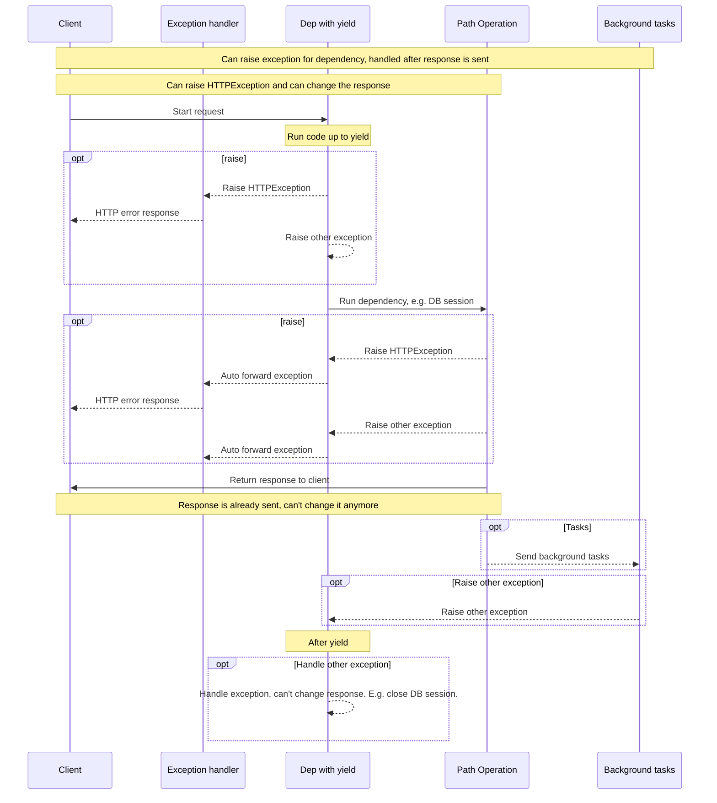

# release-notes

## 0.136.3 (2026-05-23)

### Refactors

* ♻️ Do not accept underscore headers when using `convert_underscores=True` (the default). PR [#15589](https://github.com/fastapi/fastapi/pull/15589) by [@tiangolo](https://github.com/tiangolo).

## 0.136.1 (2026-04-23)

### Upgrades

* ⬆️ Update Pydantic v2 code to address deprecations. PR [#15101](https://github.com/fastapi/fastapi/pull/15101) by [@svlandeg](https://github.com/svlandeg).

### Internal

## 0.136.1 (2026-04-23) (part 2)

* 🔨 Tweak translation script. PR [#15174](https://github.com/fastapi/fastapi/pull/15174) by [@YuriiMotov](https://github.com/YuriiMotov).
* ⬆ Bump mkdocs-material from 9.7.1 to 9.7.6. PR [#15408](https://github.com/fastapi/fastapi/pull/15408) by [@dependabot[bot]](https://github.com/apps/dependabot).
* ⬆ Bump inline-snapshot from 0.31.1 to 0.32.6. PR [#15409](https://github.com/fastapi/fastapi/pull/15409) by [@dependabot[bot]](https://github.com/apps/dependabot).
* ⬆ Bump pytest-codspeed from 4.3.0 to 4.4.0. PR [#15407](https://github.com/fastapi/fastapi/pull/15407) by [@dependabot[bot]](https://github.com/apps/dependabot).
* ⬆ Bump pytest-cov from 7.0.0 to 7.1.0. PR [#15406](https://github.com/fastapi/fastapi/pull/15406) by [@dependabot[bot]](https://github.com/apps/dependabot).
* ⬆ Bump cloudflare/wrangler-action from 3.14.1 to 3.15.0. PR [#15405](https://github.com/fastapi/fastapi/pull/15405) by [@dependabot[bot]](https://github.com/apps/dependabot).
* ⬆ Bump mypy from 1.19.1 to 1.20.1. PR [#15410](https://github.com/fastapi/fastapi/pull/15410) by [@dependabot[bot]](https://github.com/apps/dependabot).
* ⬆ Bump python-dotenv from 1.2.1 to 1.2.2. PR [#15400](https://github.com/fastapi/fastapi/pull/15400) by [@dependabot[bot]](https://github.com/apps/dependabot).
* ⬆ Bump starlette from 0.52.1 to 1.0.0. PR [#15397](https://github.com/fastapi/fastapi/pull/15397) by [@dependabot[bot]](https://github.com/apps/dependabot).
* ⬆ Bump pygithub from 2.8.1 to 2.9.1. PR [#15396](https://github.com/fastapi/fastapi/pull/15396) by [@dependabot[bot]](https://github.com/apps/dependabot).
* ⬆ Bump pyjwt from 2.12.0 to 2.12.1. PR [#15393](https://github.com/fastapi/fastapi/pull/15393) by [@dependabot[bot]](https://github.com/apps/dependabot).
* ⬆ Bump zizmor from 1.23.1 to 1.24.1. PR [#15394](https://github.com/fastapi/fastapi/pull/15394) by [@dependabot[bot]](https://github.com/apps/dependabot).
* ⬆ Bump strawberry-graphql from 0.312.3 to 0.314.3. PR [#15395](https://github.com/fastapi/fastapi/pull/15395) by [@dependabot[bot]](https://github.com/apps/dependabot).
* ⬆ Bump python-multipart from 0.0.22 to 0.0.26. PR [#15360](https://github.com/fastapi/fastapi/pull/15360) by [@dependabot[bot]](https://github.com/apps/dependabot).
* ⬆ Bump authlib from 1.6.9 to 1.6.11. PR [#15373](https://github.com/fastapi/fastapi/pull/15373) by [@dependabot[bot]](https://github.com/apps/dependabot).
* ⬆ Bump aiohttp from 3.13.3 to 3.13.4. PR [#15282](https://github.com/fastapi/fastapi/pull/15282) by [@dependabot[bot]](https://github.com/apps/dependabot).
* ⬆ Bump pygments from 2.19.2 to 2.20.0. PR [#15263](https://github.com/fastapi/fastapi/pull/15263) by [@dependabot[bot]](https://github.com/apps/dependabot).
* ⬆ Bump pymdown-extensions from 10.20.1 to 10.21.2. PR [#15391](https://github.com/fastapi/fastapi/pull/15391) by [@YuriiMotov](https://github.com/YuriiMotov).
* ⬆ Bump pillow from 12.1.1 to 12.2.0. PR [#15333](https://github.com/fastapi/fastapi/pull/15333) by [@dependabot[bot]](https://github.com/apps/dependabot).
* ⬆ Bump pytest from 9.0.2 to 9.0.3. PR [#15334](https://github.com/fastapi/fastapi/pull/15334) by [@dependabot[bot]](https://github.com/apps/dependabot).
* ⬆ Bump actions/upload-artifact from 7.0.0 to 7.0.1. PR [#15374](https://github.com/fastapi/fastapi/pull/15374) by [@dependabot[bot]](https://github.com/apps/dependabot).
* ⬆ Bump actions/cache from 5.0.4 to 5.0.5. PR [#15385](https://github.com/fastapi/fastapi/pull/15385) by [@dependabot[bot]](https://github.com/apps/dependabot).
* 🔧 Update sponsors: remove Zuplo. PR [#15369](https://github.com/fastapi/fastapi/pull/15369) by [@tiangolo](https://github.com/tiangolo).
* 🔧 Update sponsors: remove Speakeasy. PR [#15368](https://github.com/fastapi/fastapi/pull/15368) by [@tiangolo](https://github.com/tiangolo).
* 🔒️ Add zizmor and fix audit findings. PR [#15316](https://github.com/fastapi/fastapi/pull/15316) by [@YuriiMotov](https://github.com/YuriiMotov).

## 0.135.4 (2026-04-16)

### Refactors

* 🔥 Remove April Fool's `@app.vibe()` 🤪. PR [#15363](https://github.com/fastapi/fastapi/pull/15363) by [@tiangolo](https://github.com/tiangolo).

### Internal

* ⬆ Bump cryptography from 46.0.5 to 46.0.7. PR [#15314](https://github.com/fastapi/fastapi/pull/15314) by [@dependabot[bot]](https://github.com/apps/dependabot).
* ⬆ Bump strawberry-graphql from 0.307.1 to 0.312.3. PR [#15309](https://github.com/fastapi/fastapi/pull/15309) by [@dependabot[bot]](https://github.com/apps/dependabot).
* 🔨 Add pre-commit hook to ensure latest release header has date. PR [#15293](https://github.com/fastapi/fastapi/pull/15293) by [@YuriiMotov](https://github.com/YuriiMotov).

## 0.132.0 (2026-02-23)

### Breaking Changes

* 🔒️ Add `strict_content_type` checking for JSON requests. PR [#14978](https://github.com/fastapi/fastapi/pull/14978) by [@tiangolo](https://github.com/tiangolo).
    * Now FastAPI checks, by default, that JSON requests have a `Content-Type` header with a valid JSON value, like `application/json`, and rejects requests that don't.
    * If the clients for your app don't send a valid `Content-Type` header you can disable this with `strict_content_type=False`.
    * Check the new docs: [Strict Content-Type Checking](https://fastapi.tiangolo.com/advanced/strict-content-type/).

### Internal

* ⬆ Bump flask from 3.1.2 to 3.1.3. PR [#14949](https://github.com/fastapi/fastapi/pull/14949) by [@dependabot[bot]](https://github.com/apps/dependabot).
* ⬆ Update all dependencies to use `griffelib` instead of `griffe`. PR [#14973](https://github.com/fastapi/fastapi/pull/14973) by [@svlandeg](https://github.com/svlandeg).
* 🔨 Fix `FastAPI People` workflow. PR [#14951](https://github.com/fastapi/fastapi/pull/14951) by [@YuriiMotov](https://github.com/YuriiMotov).
* 👷 Do not run codspeed with coverage as it's not tracked. PR [#14966](https://github.com/fastapi/fastapi/pull/14966) by [@tiangolo](https://github.com/tiangolo).
* 👷 Do not include benchmark tests in coverage to speed up coverage processing. PR [#14965](https://github.com/fastapi/fastapi/pull/14965) by [@tiangolo](https://github.com/tiangolo).

## 0.130.0 (2026-02-22)

### Features

* ✨ Serialize JSON response with Pydantic (in Rust), when there's a Pydantic return type or response model. PR [#14962](https://github.com/fastapi/fastapi/pull/14962) by [@tiangolo](https://github.com/tiangolo).
    * This results in 2x (or more) performance increase for JSON responses.
    * New docs: [Custom Response - JSON Performance](https://fastapi.tiangolo.com/advanced/custom-response/#json-performance).

## 0.128.5 (2026-02-08)

### Refactors

* ♻️ Refactor and simplify Pydantic v2 (and v1) compatibility internal utils. PR [#14862](https://github.com/fastapi/fastapi/pull/14862) by [@tiangolo](https://github.com/tiangolo).

### Internal

* ✅ Add inline snapshot tests for OpenAPI before changes from Pydantic v2. PR [#14864](https://github.com/fastapi/fastapi/pull/14864) by [@tiangolo](https://github.com/tiangolo).

## 0.128.3 (2026-02-06)

### Refactors

* ♻️ Re-implement `on_event` in FastAPI for compatibility with the next Starlette, while keeping backwards compatibility. PR [#14851](https://github.com/fastapi/fastapi/pull/14851) by [@tiangolo](https://github.com/tiangolo).

### Upgrades

* ⬆️ Upgrade Starlette supported version range to `starlette>=0.40.0,<1.0.0`. PR [#14853](https://github.com/fastapi/fastapi/pull/14853) by [@tiangolo](https://github.com/tiangolo).

### Translations

* 🌐 Update translations for ru (update-outdated). PR [#14834](https://github.com/fastapi/fastapi/pull/14834) by [@tiangolo](https://github.com/tiangolo).

### Internal

* 👷 Run tests with Starlette from git. PR [#14849](https://github.com/fastapi/fastapi/pull/14849) by [@tiangolo](https://github.com/tiangolo).
* 👷 Run tests with lower bound uv sync, upgrade `fastapi[all]` minimum dependencies: `ujson >=5.8.0`, `orjson >=3.9.3`. PR [#14846](https://github.com/fastapi/fastapi/pull/14846) by [@tiangolo](https://github.com/tiangolo).

## 0.126.0 (2025-12-20)

### Upgrades

* ➖ Drop support for Pydantic v1, keeping short temporary support for Pydantic v2's `pydantic.v1`. PR [#14575](https://github.com/fastapi/fastapi/pull/14575) by [@tiangolo](https://github.com/tiangolo).
    * The minimum version of Pydantic installed is now `pydantic >=2.7.0`.
    * The `standard` dependencies now include `pydantic-settings >=2.0.0` and `pydantic-extra-types >=2.0.0`.

### Docs

* 📝 Fix duplicated variable in `docs_src/python_types/tutorial005_py39.py`. PR [#14565](https://github.com/fastapi/fastapi/pull/14565) by [@paras-verma7454](https://github.com/paras-verma7454).

### Translations

* 🔧 Add LLM prompt file for Ukrainian, generated from the existing translations. PR [#14548](https://github.com/fastapi/fastapi/pull/14548) by [@tiangolo](https://github.com/tiangolo).

### Internal

* 🔧 Tweak pre-commit to allow committing release-notes. PR [#14577](https://github.com/fastapi/fastapi/pull/14577) by [@tiangolo](https://github.com/tiangolo).
* ⬆️ Use prek as a pre-commit alternative. PR [#14572](https://github.com/fastapi/fastapi/pull/14572) by [@tiangolo](https://github.com/tiangolo).
* 👷 Add performance tests with CodSpeed. PR [#14558](https://github.com/fastapi/fastapi/pull/14558) by [@tiangolo](https://github.com/tiangolo).

## 0.124.2 (2025-12-10)

### Fixes

* 🐛 Fix support for `if TYPE_CHECKING`,  non-evaluated stringified annotations. PR [#14485](https://github.com/fastapi/fastapi/pull/14485) by [@tiangolo](https://github.com/tiangolo).

## 0.123.9 (2025-12-04)

### Fixes

* 🐛 Fix OAuth2 scopes in OpenAPI in extra corner cases, parent dependency with scopes, sub-dependency security scheme without scopes. PR [#14459](https://github.com/fastapi/fastapi/pull/14459) by [@tiangolo](https://github.com/tiangolo).

## 0.123.8 (2025-12-04)

### Fixes

* 🐛 Fix OpenAPI security scheme OAuth2 scopes declaration, deduplicate security schemes with different scopes. PR [#14455](https://github.com/fastapi/fastapi/pull/14455) by [@tiangolo](https://github.com/tiangolo).

## 0.123.6 (2025-12-04)

### Fixes

* 🐛 Fix support for functools wraps and partial combined, for async and regular functions and classes in path operations and dependencies. PR [#14448](https://github.com/fastapi/fastapi/pull/14448) by [@tiangolo](https://github.com/tiangolo).

## 0.123.0 (2025-11-30)

### Fixes

* 🐛 Cache dependencies that don't use scopes and don't have sub-dependencies with scopes. PR [#14419](https://github.com/fastapi/fastapi/pull/14419) by [@tiangolo](https://github.com/tiangolo).

## 0.121.1 (2025-11-08)

### Fixes

* 🐛 Fix `Depends(func, scope='function')` for top level (parameterless) dependencies. PR [#14301](https://github.com/fastapi/fastapi/pull/14301) by [@luzzodev](https://github.com/luzzodev).

### Docs

* 📝 Update docs for advanced dependencies with `yield`, noting the changes in 0.121.0, adding `scope`. PR [#14287](https://github.com/fastapi/fastapi/pull/14287) by [@tiangolo](https://github.com/tiangolo).

### Internal

* ⬆ Bump ruff from 0.13.2 to 0.14.3. PR [#14276](https://github.com/fastapi/fastapi/pull/14276) by [@dependabot[bot]](https://github.com/apps/dependabot).
* ⬆ [pre-commit.ci] pre-commit autoupdate. PR [#14289](https://github.com/fastapi/fastapi/pull/14289) by [@pre-commit-ci[bot]](https://github.com/apps/pre-commit-ci).

## 0.120.2 (2025-10-29)

### Fixes

* 🐛 Fix separation of schemas with nested models introduced in 0.119.0. PR [#14246](https://github.com/fastapi/fastapi/pull/14246) by [@tiangolo](https://github.com/tiangolo).

### Internal

* 🔧 Add sponsor: SerpApi. PR [#14248](https://github.com/fastapi/fastapi/pull/14248) by [@tiangolo](https://github.com/tiangolo).
* ⬆ Bump actions/download-artifact from 5 to 6. PR [#14236](https://github.com/fastapi/fastapi/pull/14236) by [@dependabot[bot]](https://github.com/apps/dependabot).
* ⬆ [pre-commit.ci] pre-commit autoupdate. PR [#14237](https://github.com/fastapi/fastapi/pull/14237) by [@pre-commit-ci[bot]](https://github.com/apps/pre-commit-ci).
* ⬆ Bump actions/upload-artifact from 4 to 5. PR [#14235](https://github.com/fastapi/fastapi/pull/14235) by [@dependabot[bot]](https://github.com/apps/dependabot).

## 0.120.0 (2025-10-23)

There are no major nor breaking changes in this release. ☕️

The internal reference documentation now uses `annotated_doc.Doc` instead of `typing_extensions.Doc`, this adds a new (very small) dependency on [`annotated-doc`](https://github.com/fastapi/annotated-doc), a package made just to provide that `Doc` documentation utility class.

I would expect `typing_extensions.Doc` to be deprecated and then removed at some point from `typing_extensions`, for that reason there's the new `annotated-doc` micro-package. If you are curious about this, you can read more in the repo for [`annotated-doc`](https://github.com/fastapi/annotated-doc).

This new version `0.120.0` only contains that transition to the new home package for that utility class `Doc`.

### Translations

* 🌐 Sync German docs. PR [#14188](https://github.com/fastapi/fastapi/pull/14188) by [@nilslindemann](https://github.com/nilslindemann).

### Internal

* ➕ Migrate internal reference documentation from `typing_extensions.Doc` to `annotated_doc.Doc`. PR [#14222](https://github.com/fastapi/fastapi/pull/14222) by [@tiangolo](https://github.com/tiangolo).
* 🛠️ Update German LLM prompt and test file. PR [#14189](https://github.com/fastapi/fastapi/pull/14189) by [@nilslindemann](https://github.com/nilslindemann).
* ⬆ [pre-commit.ci] pre-commit autoupdate. PR [#14181](https://github.com/fastapi/fastapi/pull/14181) by [@pre-commit-ci[bot]](https://github.com/apps/pre-commit-ci).

## 0.119.0 (2025-10-11)

FastAPI now (temporarily) supports both Pydantic v2 models and `pydantic.v1` models at the same time in the same app, to make it easier for any FastAPI apps still using Pydantic v1 to gradually but quickly **migrate to Pydantic v2**.

```Python
from fastapi import FastAPI
from pydantic import BaseModel as BaseModelV2
from pydantic.v1 import BaseModel

class Item(BaseModel):
    name: str
    description: str | None = None

class ItemV2(BaseModelV2):
    title: str
    summary: str | None = None

app = FastAPI()

@app.post("/items/", response_model=ItemV2)
def create_item(item: Item):
    return {"title": item.name, "summary": item.description}
```

Adding this feature was a big effort with the main objective of making it easier for the few applications still stuck in Pydantic v1 to migrate to Pydantic v2.

And with this, support for **Pydantic v1 is now deprecated** and will be **removed** from FastAPI in a future version soon.

**Note**: have in mind that the Pydantic team already stopped supporting Pydantic v1 for recent versions of Python, starting with Python 3.14.

You can read in the docs more about how to [Migrate from Pydantic v1 to Pydantic v2](https://fastapi.tiangolo.com/how-to/migrate-from-pydantic-v1-to-pydantic-v2/).

### Features

* ✨ Add support for `from pydantic.v1 import BaseModel`, mixed Pydantic v1 and v2 models in the same app. PR [#14168](https://github.com/fastapi/fastapi/pull/14168) by [@tiangolo](https://github.com/tiangolo).

## 0.118.2 (2025-10-08)

### Fixes

* 🐛 Fix tagged discriminated union not recognized as body field. PR [#12942](https://github.com/fastapi/fastapi/pull/12942) by [@frankie567](https://github.com/frankie567).

### Internal

* ⬆ Bump astral-sh/setup-uv from 6 to 7. PR [#14167](https://github.com/fastapi/fastapi/pull/14167) by [@dependabot[bot]](https://github.com/apps/dependabot).

## 0.118.1 (2025-10-08)

### Upgrades

* 👽️ Ensure compatibility with Pydantic 2.12.0. PR [#14036](https://github.com/fastapi/fastapi/pull/14036) by [@cjwatson](https://github.com/cjwatson).

### Docs

* 📝 Add External Link: Getting started with logging in FastAPI. PR [#14152](https://github.com/fastapi/fastapi/pull/14152) by [@itssimon](https://github.com/itssimon).

### Translations

* 🔨 Add Russian translations LLM prompt. PR [#13936](https://github.com/fastapi/fastapi/pull/13936) by [@tiangolo](https://github.com/tiangolo).
* 🌐 Sync German docs. PR [#14149](https://github.com/fastapi/fastapi/pull/14149) by [@nilslindemann](https://github.com/nilslindemann).
* 🌐 Add Russian translations for missing pages (LLM-generated). PR [#14135](https://github.com/fastapi/fastapi/pull/14135) by [@YuriiMotov](https://github.com/YuriiMotov).
* 🌐 Update Russian translations for existing pages (LLM-generated). PR [#14123](https://github.com/fastapi/fastapi/pull/14123) by [@YuriiMotov](https://github.com/YuriiMotov).
* 🌐 Remove configuration files for inactive translations. PR [#14130](https://github.com/fastapi/fastapi/pull/14130) by [@tiangolo](https://github.com/tiangolo).

### Internal

## 0.118.1 (2025-10-08) (part 2)

* 🔨 Move local coverage logic to its own script. PR [#14166](https://github.com/fastapi/fastapi/pull/14166) by [@tiangolo](https://github.com/tiangolo).
* ⬆ [pre-commit.ci] pre-commit autoupdate. PR [#14161](https://github.com/fastapi/fastapi/pull/14161) by [@pre-commit-ci[bot]](https://github.com/apps/pre-commit-ci).
* ⬆ Bump griffe-typingdoc from 0.2.8 to 0.2.9. PR [#14144](https://github.com/fastapi/fastapi/pull/14144) by [@dependabot[bot]](https://github.com/apps/dependabot).
* ⬆ Bump mkdocs-macros-plugin from 1.3.9 to 1.4.0. PR [#14145](https://github.com/fastapi/fastapi/pull/14145) by [@dependabot[bot]](https://github.com/apps/dependabot).
* ⬆ Bump markdown-include-variants from 0.0.4 to 0.0.5. PR [#14146](https://github.com/fastapi/fastapi/pull/14146) by [@dependabot[bot]](https://github.com/apps/dependabot).
* ⬆ [pre-commit.ci] pre-commit autoupdate. PR [#14126](https://github.com/fastapi/fastapi/pull/14126) by [@pre-commit-ci[bot]](https://github.com/apps/pre-commit-ci).
* 👥 Update FastAPI GitHub topic repositories. PR [#14150](https://github.com/fastapi/fastapi/pull/14150) by [@tiangolo](https://github.com/tiangolo).
* 👥 Update FastAPI People - Sponsors. PR [#14139](https://github.com/fastapi/fastapi/pull/14139) by [@tiangolo](https://github.com/tiangolo).
* 👥 Update FastAPI People - Contributors and Translators. PR [#14138](https://github.com/fastapi/fastapi/pull/14138) by [@tiangolo](https://github.com/tiangolo).
* ⬆ Bump ruff from 0.12.7 to 0.13.2. PR [#14147](https://github.com/fastapi/fastapi/pull/14147) by [@dependabot[bot]](https://github.com/apps/dependabot).
* ⬆ Bump sqlmodel from 0.0.24 to 0.0.25. PR [#14143](https://github.com/fastapi/fastapi/pull/14143) by [@dependabot[bot]](https://github.com/apps/dependabot).
* ⬆ Bump tiangolo/issue-manager from 0.5.1 to 0.6.0. PR [#14148](https://github.com/fastapi/fastapi/pull/14148) by [@dependabot[bot]](https://github.com/apps/dependabot).
* 👷 Update docs previews comment, single comment, add failure status. PR [#14129](https://github.com/fastapi/fastapi/pull/14129) by [@tiangolo](https://github.com/tiangolo).
* 🔨 Modify `mkdocs_hooks.py` to add `title` to page's metadata (remove permalinks in social cards). PR [#14125](https://github.com/fastapi/fastapi/pull/14125) by [@YuriiMotov](https://github.com/YuriiMotov).

## 0.118.0 (2025-09-29)

### Fixes

* 🐛 Fix support for `StreamingResponse`s with dependencies with `yield` or `UploadFile`s, close after the response is done. PR [#14099](https://github.com/fastapi/fastapi/pull/14099) by [@tiangolo](https://github.com/tiangolo).

Before FastAPI 0.118.0, if you used a dependency with `yield`, it would run the exit code after the *path operation function* returned but right before sending the response.

This change also meant that if you returned a `StreamingResponse`, the exit code of the dependency with `yield` would have been already run.

For example, if you had a database session in a dependency with `yield`, the `StreamingResponse` would not be able to use that session while streaming data because the session would have already been closed in the exit code after `yield`.

This behavior was reverted in 0.118.0, to make the exit code after `yield` be executed after the response is sent.

You can read more about it in the docs for [Advanced Dependencies - Dependencies with `yield`, `HTTPException`, `except` and Background Tasks](https://fastapi.tiangolo.com/advanced/advanced-dependencies#dependencies-with-yield-httpexception-except-and-background-tasks). Including what you could do if you wanted to close a database session earlier, before returning the response to the client.

### Docs

* 📝 Update `tutorial/security/oauth2-jwt/` to use `pwdlib` with Argon2 instead of `passlib`. PR [#13917](https://github.com/fastapi/fastapi/pull/13917) by [@Neizvestnyj](https://github.com/Neizvestnyj).
* ✏️ Fix typos in OAuth2 password request forms. PR [#14112](https://github.com/fastapi/fastapi/pull/14112) by [@alv2017](https://github.com/alv2017).
* 📝 Update contributing guidelines for installing requirements. PR [#14095](https://github.com/fastapi/fastapi/pull/14095) by [@alejsdev](https://github.com/alejsdev).

### Translations

* 🌐 Sync German docs. PR [#14098](https://github.com/fastapi/fastapi/pull/14098) by [@nilslindemann](https://github.com/nilslindemann).

### Internal

* ⬆ [pre-commit.ci] pre-commit autoupdate. PR [#14103](https://github.com/fastapi/fastapi/pull/14103) by [@pre-commit-ci[bot]](https://github.com/apps/pre-commit-ci).
* ♻️ Refactor sponsor image handling. PR [#14102](https://github.com/fastapi/fastapi/pull/14102) by [@alejsdev](https://github.com/alejsdev).
* 🐛 Fix sponsor display issue by hiding element on image error. PR [#14097](https://github.com/fastapi/fastapi/pull/14097) by [@alejsdev](https://github.com/alejsdev).
* 🐛 Hide sponsor badge when sponsor image is not displayed. PR [#14096](https://github.com/fastapi/fastapi/pull/14096) by [@alejsdev](https://github.com/alejsdev).

## 0.116.1 (2025-07-11)

### Upgrades

* ⬆️ Upgrade Starlette supported version range to `>=0.40.0,<0.48.0`. PR [#13884](https://github.com/fastapi/fastapi/pull/13884) by [@tiangolo](https://github.com/tiangolo).

### Docs

* 📝 Add notification about impending changes in Translations to `docs/en/docs/contributing.md`. PR [#13886](https://github.com/fastapi/fastapi/pull/13886) by [@YuriiMotov](https://github.com/YuriiMotov).

### Internal

* ⬆ [pre-commit.ci] pre-commit autoupdate. PR [#13871](https://github.com/fastapi/fastapi/pull/13871) by [@pre-commit-ci[bot]](https://github.com/apps/pre-commit-ci).

## 0.116.0 (2025-07-07)

### Features

* ✨ Add support for deploying to FastAPI Cloud with `fastapi deploy`. PR [#13870](https://github.com/fastapi/fastapi/pull/13870) by [@tiangolo](https://github.com/tiangolo).

Installing `fastapi[standard]` now includes `fastapi-cloud-cli`.

This will allow you to deploy to [FastAPI Cloud](https://fastapicloud.com) with the `fastapi deploy` command.

If you want to install `fastapi` with the standard dependencies but without `fastapi-cloud-cli`, you can install instead `fastapi[standard-no-fastapi-cloud-cli]`.

### Translations

* 🌐 Add Russian translation for `docs/ru/docs/advanced/response-directly.md`. PR [#13801](https://github.com/fastapi/fastapi/pull/13801) by [@NavesSapnis](https://github.com/NavesSapnis).
* 🌐 Add Russian translation for `docs/ru/docs/advanced/additional-status-codes.md`. PR [#13799](https://github.com/fastapi/fastapi/pull/13799) by [@NavesSapnis](https://github.com/NavesSapnis).
* 🌐 Add Ukrainian translation for `docs/uk/docs/tutorial/body-updates.md`. PR [#13804](https://github.com/fastapi/fastapi/pull/13804) by [@valentinDruzhinin](https://github.com/valentinDruzhinin).

### Internal

* ⬆ Bump pillow from 11.1.0 to 11.3.0. PR [#13852](https://github.com/fastapi/fastapi/pull/13852) by [@dependabot[bot]](https://github.com/apps/dependabot).
* 👥 Update FastAPI People - Sponsors. PR [#13846](https://github.com/fastapi/fastapi/pull/13846) by [@tiangolo](https://github.com/tiangolo).
* 👥 Update FastAPI GitHub topic repositories. PR [#13848](https://github.com/fastapi/fastapi/pull/13848) by [@tiangolo](https://github.com/tiangolo).
* ⬆ Bump mkdocs-material from 9.6.1 to 9.6.15. PR [#13849](https://github.com/fastapi/fastapi/pull/13849) by [@dependabot[bot]](https://github.com/apps/dependabot).
* ⬆ [pre-commit.ci] pre-commit autoupdate. PR [#13843](https://github.com/fastapi/fastapi/pull/13843) by [@pre-commit-ci[bot]](https://github.com/apps/pre-commit-ci).
* 👥 Update FastAPI People - Contributors and Translators. PR [#13845](https://github.com/fastapi/fastapi/pull/13845) by [@tiangolo](https://github.com/tiangolo).

## 0.115.6 (2024-12-03)

### Fixes

* 🐛 Preserve traceback when an exception is raised in sync dependency with `yield`. PR [#5823](https://github.com/fastapi/fastapi/pull/5823) by [@sombek](https://github.com/sombek).

### Refactors

* ♻️ Update tests and internals for compatibility with Pydantic >=2.10. PR [#12971](https://github.com/fastapi/fastapi/pull/12971) by [@tamird](https://github.com/tamird).

### Docs

* 📝 Update includes format in docs with an automated script. PR [#12950](https://github.com/fastapi/fastapi/pull/12950) by [@tiangolo](https://github.com/tiangolo).
* 📝 Update includes for `docs/de/docs/advanced/using-request-directly.md`. PR [#12685](https://github.com/fastapi/fastapi/pull/12685) by [@alissadb](https://github.com/alissadb).
* 📝 Update includes for `docs/de/docs/how-to/conditional-openapi.md`. PR [#12689](https://github.com/fastapi/fastapi/pull/12689) by [@alissadb](https://github.com/alissadb).

### Translations

* 🌐 Add Traditional Chinese translation for `docs/zh-hant/docs/async.md`. PR [#12990](https://github.com/fastapi/fastapi/pull/12990) by [@ILoveSorasakiHina](https://github.com/ILoveSorasakiHina).
* 🌐 Add Traditional Chinese translation for `docs/zh-hant/docs/tutorial/query-param-models.md`. PR [#12932](https://github.com/fastapi/fastapi/pull/12932) by [@Vincy1230](https://github.com/Vincy1230).
* 🌐 Add Korean translation for `docs/ko/docs/advanced/testing-dependencies.md`. PR [#12992](https://github.com/fastapi/fastapi/pull/12992) by [@Limsunoh](https://github.com/Limsunoh).
* 🌐 Add Korean translation for `docs/ko/docs/advanced/websockets.md`. PR [#12991](https://github.com/fastapi/fastapi/pull/12991) by [@kwang1215](https://github.com/kwang1215).
* 🌐 Add Portuguese translation for `docs/pt/docs/tutorial/response-model.md`. PR [#12933](https://github.com/fastapi/fastapi/pull/12933) by [@AndreBBM](https://github.com/AndreBBM).
* 🌐 Add Korean translation for `docs/ko/docs/advanced/middlewares.md`. PR [#12753](https://github.com/fastapi/fastapi/pull/12753) by [@nahyunkeem](https://github.com/nahyunkeem).
* 🌐 Add Korean translation for `docs/ko/docs/advanced/openapi-webhooks.md`. PR [#12752](https://github.com/fastapi/fastapi/pull/12752) by [@saeye](https://github.com/saeye).
* 🌐 Add Chinese translation for `docs/zh/docs/tutorial/query-param-models.md`. PR [#12931](https://github.com/fastapi/fastapi/pull/12931) by [@Vincy1230](https://github.com/Vincy1230).
* 🌐 Add Russian translation for `docs/ru/docs/tutorial/query-param-models.md`. PR [#12445](https://github.com/fastapi/fastapi/pull/12445) by [@gitgernit](https://github.com/gitgernit).
* 🌐 Add Korean translation for `docs/ko/docs/tutorial/query-param-models.md`. PR [#12940](https://github.com/fastapi/fastapi/pull/12940) by [@jts8257](https://github.com/jts8257).
* 🔥 Remove obsolete tutorial translation to Chinese for `docs/zh/docs/tutorial/sql-databases.md`, it references files that are no longer on the repo. PR [#12949](https://github.com/fastapi/fastapi/pull/12949) by [@tiangolo](https://github.com/tiangolo).

### Internal

## 0.115.6 (2024-12-03) (part 2)

* ⬆ [pre-commit.ci] pre-commit autoupdate. PR [#12954](https://github.com/fastapi/fastapi/pull/12954) by [@pre-commit-ci[bot]](https://github.com/apps/pre-commit-ci).

## 0.115.0 (2024-09-17)

### Highlights

Now you can declare `Query`, `Header`, and `Cookie` parameters with Pydantic models. 🎉

#### `Query` Parameter Models

Use Pydantic models for `Query` parameters:

```python
from typing import Annotated, Literal

from fastapi import FastAPI, Query
from pydantic import BaseModel, Field

app = FastAPI()

class FilterParams(BaseModel):
    limit: int = Field(100, gt=0, le=100)
    offset: int = Field(0, ge=0)
    order_by: Literal["created_at", "updated_at"] = "created_at"
    tags: list[str] = []

@app.get("/items/")
async def read_items(filter_query: Annotated[FilterParams, Query()]):
    return filter_query
```

Read the new docs: [Query Parameter Models](https://fastapi.tiangolo.com/tutorial/query-param-models/).

#### `Header` Parameter Models

Use Pydantic models for `Header` parameters:

```python
from typing import Annotated

from fastapi import FastAPI, Header
from pydantic import BaseModel

app = FastAPI()

class CommonHeaders(BaseModel):
    host: str
    save_data: bool
    if_modified_since: str | None = None
    traceparent: str | None = None
    x_tag: list[str] = []

@app.get("/items/")
async def read_items(headers: Annotated[CommonHeaders, Header()]):
    return headers
```

Read the new docs: [Header Parameter Models](https://fastapi.tiangolo.com/tutorial/header-param-models/).

#### `Cookie` Parameter Models

Use Pydantic models for `Cookie` parameters:

```python
from typing import Annotated

from fastapi import Cookie, FastAPI
from pydantic import BaseModel

app = FastAPI()

class Cookies(BaseModel):
    session_id: str
    fatebook_tracker: str | None = None
    googall_tracker: str | None = None

@app.get("/items/")
async def read_items(cookies: Annotated[Cookies, Cookie()]):
    return cookies
```

Read the new docs: [Cookie Parameter Models](https://fastapi.tiangolo.com/tutorial/cookie-param-models/).

#### Forbid Extra Query (Cookie, Header) Parameters

Use Pydantic models to restrict extra values for `Query` parameters (also applies to `Header` and `Cookie` parameters).

To achieve it, use Pydantic's `model_config = {"extra": "forbid"}`:

```python
from typing import Annotated, Literal

from fastapi import FastAPI, Query
from pydantic import BaseModel, Field

app = FastAPI()

class FilterParams(BaseModel):
    model_config = {"extra": "forbid"}

    limit: int = Field(100, gt=0, le=100)
    offset: int = Field(0, ge=0)
    order_by: Literal["created_at", "updated_at"] = "created_at"
    tags: list[str] = []

@app.get("/items/")
async def read_items(filter_query: Annotated[FilterParams, Query()]):
    return filter_query
```

This applies to `Query`, `Header`, and `Cookie` parameters, read the new docs:

* [Forbid Extra Query Parameters](https://fastapi.tiangolo.com/tutorial/query-param-models/#forbid-extra-query-parameters)
* [Forbid Extra Headers](https://fastapi.tiangolo.com/tutorial/header-param-models/#forbid-extra-headers)
* [Forbid Extra Cookies](https://fastapi.tiangolo.com/tutorial/cookie-param-models/#forbid-extra-cookies)

### Features

## 0.115.0 (2024-09-17) (part 2)

* ✨ Add support for Pydantic models for parameters using `Query`, `Cookie`, `Header`. PR [#12199](https://github.com/fastapi/fastapi/pull/12199) by [@tiangolo](https://github.com/tiangolo).

### Translations

* 🌐 Add Portuguese translation for `docs/pt/docs/advanced/security/http-basic-auth.md`. PR [#12195](https://github.com/fastapi/fastapi/pull/12195) by [@ceb10n](https://github.com/ceb10n).

### Internal

* ⬆ [pre-commit.ci] pre-commit autoupdate. PR [#12204](https://github.com/fastapi/fastapi/pull/12204) by [@pre-commit-ci[bot]](https://github.com/apps/pre-commit-ci).

## 0.114.0 (2024-09-06)

You can restrict form fields to only include those declared in a Pydantic model and forbid any extra field sent in the request using Pydantic's `model_config = {"extra": "forbid"}`:

```python
from typing import Annotated

from fastapi import FastAPI, Form
from pydantic import BaseModel

app = FastAPI()

class FormData(BaseModel):
    username: str
    password: str
    model_config = {"extra": "forbid"}

@app.post("/login/")
async def login(data: Annotated[FormData, Form()]):
    return data
```

Read the new docs: [Form Models - Forbid Extra Form Fields](https://fastapi.tiangolo.com/tutorial/request-form-models/#forbid-extra-form-fields).

### Features

* ✨ Add support for forbidding extra form fields with Pydantic models. PR [#12134](https://github.com/fastapi/fastapi/pull/12134) by [@tiangolo](https://github.com/tiangolo).

### Docs

* 📝 Update docs, Form Models section title, to match config name. PR [#12152](https://github.com/fastapi/fastapi/pull/12152) by [@tiangolo](https://github.com/tiangolo).

### Internal

* ✅ Update internal tests for latest Pydantic, including CI tweaks to install the latest Pydantic. PR [#12147](https://github.com/fastapi/fastapi/pull/12147) by [@tiangolo](https://github.com/tiangolo).

## 0.113.0 (2024-09-05)

Now you can declare form fields with Pydantic models:

```python
from typing import Annotated

from fastapi import FastAPI, Form
from pydantic import BaseModel

app = FastAPI()

class FormData(BaseModel):
    username: str
    password: str

@app.post("/login/")
async def login(data: Annotated[FormData, Form()]):
    return data
```

Read the new docs: [Form Models](https://fastapi.tiangolo.com/tutorial/request-form-models/).

### Features

* ✨ Add support for Pydantic models in `Form` parameters. PR [#12129](https://github.com/fastapi/fastapi/pull/12129) by [@tiangolo](https://github.com/tiangolo).

### Internal

* 🔧 Update sponsors: Coherence link. PR [#12130](https://github.com/fastapi/fastapi/pull/12130) by [@tiangolo](https://github.com/tiangolo).

## 0.112.4 (2024-09-05)

This release is mainly a big internal refactor to enable adding support for Pydantic models for `Form` fields, but that feature comes in the next release.

This release shouldn't affect apps using FastAPI in any way. You don't even have to upgrade to this version yet. It's just a checkpoint. 🤓

### Refactors

* ♻️ Refactor deciding if `embed` body fields, do not overwrite fields, compute once per router, refactor internals in preparation for Pydantic models in `Form`, `Query` and others. PR [#12117](https://github.com/fastapi/fastapi/pull/12117) by [@tiangolo](https://github.com/tiangolo).

### Internal

* ⏪️ Temporarily revert "✨ Add support for Pydantic models in `Form` parameters" to make a checkpoint release. PR [#12128](https://github.com/fastapi/fastapi/pull/12128) by [@tiangolo](https://github.com/tiangolo). Restored by PR [#12129](https://github.com/fastapi/fastapi/pull/12129).
* ✨ Add support for Pydantic models in `Form` parameters. PR [#12127](https://github.com/fastapi/fastapi/pull/12127) by [@tiangolo](https://github.com/tiangolo). Reverted by PR [#12128](https://github.com/fastapi/fastapi/pull/12128) to make a checkpoint release with only refactors. Restored by PR [#12129](https://github.com/fastapi/fastapi/pull/12129).

## 0.112.3 (2024-09-05)

This release is mainly internal refactors, it shouldn't affect apps using FastAPI in any way. You don't even have to upgrade to this version yet. There are a few bigger releases coming right after. 🚀

### Refactors

* ♻️ Refactor internal `check_file_field()`, rename to `ensure_multipart_is_installed()` to clarify its purpose. PR [#12106](https://github.com/fastapi/fastapi/pull/12106) by [@tiangolo](https://github.com/tiangolo).
* ♻️ Rename internal `create_response_field()` to `create_model_field()` as it's used for more than response models. PR [#12103](https://github.com/fastapi/fastapi/pull/12103) by [@tiangolo](https://github.com/tiangolo).
* ♻️ Refactor and simplify internal data from `solve_dependencies()` using dataclasses. PR [#12100](https://github.com/fastapi/fastapi/pull/12100) by [@tiangolo](https://github.com/tiangolo).
* ♻️ Refactor and simplify internal `analyze_param()` to structure data with dataclasses instead of tuple. PR [#12099](https://github.com/fastapi/fastapi/pull/12099) by [@tiangolo](https://github.com/tiangolo).
* ♻️ Refactor and simplify dependencies data structures with dataclasses. PR [#12098](https://github.com/fastapi/fastapi/pull/12098) by [@tiangolo](https://github.com/tiangolo).

### Docs

* 📝 Add External Link: Techniques and applications of SQLAlchemy global filters in FastAPI. PR [#12109](https://github.com/fastapi/fastapi/pull/12109) by [@TheShubhendra](https://github.com/TheShubhendra).
* 📝 Add note about `time.perf_counter()` in middlewares. PR [#12095](https://github.com/fastapi/fastapi/pull/12095) by [@tiangolo](https://github.com/tiangolo).
* 📝 Tweak middleware code sample `time.time()` to `time.perf_counter()`. PR [#11957](https://github.com/fastapi/fastapi/pull/11957) by [@domdent](https://github.com/domdent).
* 🔧 Update sponsors: Coherence. PR [#12093](https://github.com/fastapi/fastapi/pull/12093) by [@tiangolo](https://github.com/tiangolo).
* 📝 Fix async test example not to trigger DeprecationWarning. PR [#12084](https://github.com/fastapi/fastapi/pull/12084) by [@marcinsulikowski](https://github.com/marcinsulikowski).
* 📝 Update `docs_src/path_params_numeric_validations/tutorial006.py`. PR [#11478](https://github.com/fastapi/fastapi/pull/11478) by [@MuhammadAshiqAmeer](https://github.com/MuhammadAshiqAmeer).
* 📝 Update comma in `docs/en/docs/async.md`. PR [#12062](https://github.com/fastapi/fastapi/pull/12062) by [@Alec-Gillis](https://github.com/Alec-Gillis).
* 📝 Update docs about serving FastAPI: ASGI servers, Docker containers, etc.. PR [#12069](https://github.com/fastapi/fastapi/pull/12069) by [@tiangolo](https://github.com/tiangolo).
* 📝 Clarify `response_class` parameter, validations, and returning a response directly. PR [#12067](https://github.com/fastapi/fastapi/pull/12067) by [@tiangolo](https://github.com/tiangolo).
* 📝 Fix minor typos and issues in the documentation. PR [#12063](https://github.com/fastapi/fastapi/pull/12063) by [@svlandeg](https://github.com/svlandeg).
* 📝 Add note in Docker docs about ensuring graceful shutdowns and lifespan events with `CMD` exec form. PR [#11960](https://github.com/fastapi/fastapi/pull/11960) by [@GPla](https://github.com/GPla).

## 0.112.3 (2024-09-05) (part 2)

### Translations

* 🌐  Add Dutch translation for `docs/nl/docs/features.md`. PR [#12101](https://github.com/fastapi/fastapi/pull/12101) by [@maxscheijen](https://github.com/maxscheijen).
* 🌐 Add Portuguese translation for `docs/pt/docs/advanced/testing-events.md`. PR [#12108](https://github.com/fastapi/fastapi/pull/12108) by [@ceb10n](https://github.com/ceb10n).
* 🌐 Add Portuguese translation for `docs/pt/docs/advanced/security/index.md`. PR [#12114](https://github.com/fastapi/fastapi/pull/12114) by [@ceb10n](https://github.com/ceb10n).
* 🌐 Add Dutch translation for `docs/nl/docs/index.md`. PR [#12042](https://github.com/fastapi/fastapi/pull/12042) by [@svlandeg](https://github.com/svlandeg).
* 🌐 Update Chinese translation for `docs/zh/docs/how-to/index.md`. PR [#12070](https://github.com/fastapi/fastapi/pull/12070) by [@synthpop123](https://github.com/synthpop123).

### Internal

* ⬆ [pre-commit.ci] pre-commit autoupdate. PR [#12115](https://github.com/fastapi/fastapi/pull/12115) by [@pre-commit-ci[bot]](https://github.com/apps/pre-commit-ci).
* ⬆ Bump pypa/gh-action-pypi-publish from 1.10.0 to 1.10.1. PR [#12120](https://github.com/fastapi/fastapi/pull/12120) by [@dependabot[bot]](https://github.com/apps/dependabot).
* ⬆ Bump pillow from 10.3.0 to 10.4.0. PR [#12105](https://github.com/fastapi/fastapi/pull/12105) by [@dependabot[bot]](https://github.com/apps/dependabot).
* 💚 Set `include-hidden-files` to `True` when using the `upload-artifact` GH action. PR [#12118](https://github.com/fastapi/fastapi/pull/12118) by [@svlandeg](https://github.com/svlandeg).
* ⬆ Bump pypa/gh-action-pypi-publish from 1.9.0 to 1.10.0. PR [#12112](https://github.com/fastapi/fastapi/pull/12112) by [@dependabot[bot]](https://github.com/apps/dependabot).
* 🔧 Update sponsors link: Coherence. PR [#12097](https://github.com/fastapi/fastapi/pull/12097) by [@tiangolo](https://github.com/tiangolo).
* 🔧 Update labeler config to handle sponsorships data. PR [#12096](https://github.com/fastapi/fastapi/pull/12096) by [@tiangolo](https://github.com/tiangolo).
* 🔧 Update sponsors, remove Kong. PR [#12085](https://github.com/fastapi/fastapi/pull/12085) by [@tiangolo](https://github.com/tiangolo).
* ⬆ [pre-commit.ci] pre-commit autoupdate. PR [#12076](https://github.com/fastapi/fastapi/pull/12076) by [@pre-commit-ci[bot]](https://github.com/apps/pre-commit-ci).
* 👷 Update `latest-changes` GitHub Action. PR [#12073](https://github.com/fastapi/fastapi/pull/12073) by [@tiangolo](https://github.com/tiangolo).

## 0.112.0 (2024-08-02)

### Breaking Changes

* ♻️ Add support for `pip install "fastapi[standard]"` with standard dependencies and `python -m fastapi`. PR [#11935](https://github.com/fastapi/fastapi/pull/11935) by [@tiangolo](https://github.com/tiangolo).

#### Summary

Install with:

```bash
pip install "fastapi[standard]"
```

#### Other Changes

* This adds support for calling the CLI as:

```bash
python -m fastapi
```

* And it upgrades `fastapi-cli[standard] >=0.0.5`.

#### Technical Details

Before this, `fastapi` would include the standard dependencies, with Uvicorn and the `fastapi-cli`, etc.

And `fastapi-slim` would not include those standard dependencies.

Now `fastapi` doesn't include those standard dependencies unless you install with `pip install "fastapi[standard]"`.

Before, you would install `pip install fastapi`, now you should include the `standard` optional dependencies (unless you want to exclude one of those): `pip install "fastapi[standard]"`.

This change is because having the standard optional dependencies installed by default was being inconvenient to several users, and having to install instead `fastapi-slim` was not being a feasible solution.

Discussed here: [#11522](https://github.com/fastapi/fastapi/pull/11522) and here: [#11525](https://github.com/fastapi/fastapi/discussions/11525)

### Docs

* ✏️ Fix typos in docs. PR [#11926](https://github.com/fastapi/fastapi/pull/11926) by [@jianghuyiyuan](https://github.com/jianghuyiyuan).
* 📝 Tweak management docs. PR [#11918](https://github.com/fastapi/fastapi/pull/11918) by [@tiangolo](https://github.com/tiangolo).
* 🚚 Rename GitHub links from tiangolo/fastapi to fastapi/fastapi. PR [#11913](https://github.com/fastapi/fastapi/pull/11913) by [@tiangolo](https://github.com/tiangolo).
* 📝 Add docs about FastAPI team and project management. PR [#11908](https://github.com/tiangolo/fastapi/pull/11908) by [@tiangolo](https://github.com/tiangolo).
* 📝 Re-structure docs main menu. PR [#11904](https://github.com/tiangolo/fastapi/pull/11904) by [@tiangolo](https://github.com/tiangolo).
* 📝 Update Speakeasy URL. PR [#11871](https://github.com/tiangolo/fastapi/pull/11871) by [@ndimares](https://github.com/ndimares).

### Translations

## 0.112.0 (2024-08-02) (part 2)

* 🌐 Update Portuguese translation for `docs/pt/docs/alternatives.md`. PR [#11931](https://github.com/fastapi/fastapi/pull/11931) by [@ceb10n](https://github.com/ceb10n).
* 🌐 Add Russian translation for `docs/ru/docs/tutorial/dependencies/sub-dependencies.md`. PR [#10515](https://github.com/tiangolo/fastapi/pull/10515) by [@AlertRED](https://github.com/AlertRED).
* 🌐 Add Portuguese translation for `docs/pt/docs/advanced/response-change-status-code.md`. PR [#11863](https://github.com/tiangolo/fastapi/pull/11863) by [@ceb10n](https://github.com/ceb10n).
* 🌐 Add Portuguese translation for `docs/pt/docs/reference/background.md`. PR [#11849](https://github.com/tiangolo/fastapi/pull/11849) by [@lucasbalieiro](https://github.com/lucasbalieiro).
* 🌐 Add Portuguese translation for `docs/pt/docs/tutorial/dependencies/dependencies-with-yield.md`. PR [#11848](https://github.com/tiangolo/fastapi/pull/11848) by [@Joao-Pedro-P-Holanda](https://github.com/Joao-Pedro-P-Holanda).
* 🌐 Add Portuguese translation for `docs/pt/docs/reference/apirouter.md`. PR [#11843](https://github.com/tiangolo/fastapi/pull/11843) by [@lucasbalieiro](https://github.com/lucasbalieiro).

### Internal

* 🔧 Update sponsors: add liblab. PR [#11934](https://github.com/fastapi/fastapi/pull/11934) by [@tiangolo](https://github.com/tiangolo).
* 👷 Update GitHub Action label-approved permissions. PR [#11933](https://github.com/fastapi/fastapi/pull/11933) by [@tiangolo](https://github.com/tiangolo).
* 👷 Refactor GitHub Action to comment docs deployment URLs and update token. PR [#11925](https://github.com/fastapi/fastapi/pull/11925) by [@tiangolo](https://github.com/tiangolo).
* 👷 Update tokens for GitHub Actions. PR [#11924](https://github.com/fastapi/fastapi/pull/11924) by [@tiangolo](https://github.com/tiangolo).
* 👷 Update token permissions to comment deployment URL in docs. PR [#11917](https://github.com/fastapi/fastapi/pull/11917) by [@tiangolo](https://github.com/tiangolo).
* 👷 Update token permissions for GitHub Actions. PR [#11915](https://github.com/fastapi/fastapi/pull/11915) by [@tiangolo](https://github.com/tiangolo).
* 👷 Update GitHub Actions token usage. PR [#11914](https://github.com/fastapi/fastapi/pull/11914) by [@tiangolo](https://github.com/tiangolo).
* 👷 Update GitHub Action to notify translations with label `approved-1`. PR [#11907](https://github.com/tiangolo/fastapi/pull/11907) by [@tiangolo](https://github.com/tiangolo).
* 🔧 Update sponsors, remove Reflex. PR [#11875](https://github.com/tiangolo/fastapi/pull/11875) by [@tiangolo](https://github.com/tiangolo).
* 🔧 Update sponsors: remove TalkPython. PR [#11861](https://github.com/tiangolo/fastapi/pull/11861) by [@tiangolo](https://github.com/tiangolo).
* 🔨 Update docs Termynal scripts to not include line nums for local dev. PR [#11854](https://github.com/tiangolo/fastapi/pull/11854) by [@tiangolo](https://github.com/tiangolo).

## 0.111.0 (2024-05-03)

### Features

* ✨ Add FastAPI CLI, the new `fastapi` command. PR [#11522](https://github.com/tiangolo/fastapi/pull/11522) by [@tiangolo](https://github.com/tiangolo).
    * New docs: [FastAPI CLI](https://fastapi.tiangolo.com/fastapi-cli/).

Try it out with:

```console
$ pip install --upgrade fastapi

$ fastapi dev main.py

 ╭────────── FastAPI CLI - Development mode ───────────╮
 │                                                     │
 │  Serving at: http://127.0.0.1:8000                  │
 │                                                     │
 │  API docs: http://127.0.0.1:8000/docs               │
 │                                                     │
 │  Running in development mode, for production use:   │
 │                                                     │
 │  fastapi run                                        │
 │                                                     │
 ╰─────────────────────────────────────────────────────╯

INFO:     Will watch for changes in these directories: ['/home/user/code/awesomeapp']
INFO:     Uvicorn running on http://127.0.0.1:8000 (Press CTRL+C to quit)
INFO:     Started reloader process [2248755] using WatchFiles
INFO:     Started server process [2248757]
INFO:     Waiting for application startup.
INFO:     Application startup complete.
```

### Refactors

* 🔧 Add configs and setup for `fastapi-slim` including optional extras `fastapi-slim[standard]`, and `fastapi` including by default the same `standard` extras. PR [#11503](https://github.com/tiangolo/fastapi/pull/11503) by [@tiangolo](https://github.com/tiangolo).

## 0.110.0 (2024-02-24)

### Breaking Changes

* 🐛 Fix unhandled growing memory for internal server errors, refactor dependencies with `yield` and `except` to require raising again as in regular Python. PR [#11191](https://github.com/tiangolo/fastapi/pull/11191) by [@tiangolo](https://github.com/tiangolo).
    * This is a breaking change (and only slightly) if you used dependencies with `yield`, used `except` in those dependencies, and didn't raise again.
    * This was reported internally by [@rushilsrivastava](https://github.com/rushilsrivastava) as a memory leak when the server had unhandled exceptions that would produce internal server errors, the memory allocated before that point would not be released.
    * Read the new docs: [Dependencies with `yield` and `except`](https://fastapi.tiangolo.com/tutorial/dependencies/dependencies-with-yield/#dependencies-with-yield-and-except).

In short, if you had dependencies that looked like:

```Python
def my_dep():
    try:
        yield
    except SomeException:
        pass
```

Now you need to make sure you raise again after `except`, just as you would in regular Python:

```Python
def my_dep():
    try:
        yield
    except SomeException:
        raise
```

### Docs

* ✏️ Fix minor typos in `docs/ko/docs/`. PR [#11126](https://github.com/tiangolo/fastapi/pull/11126) by [@KaniKim](https://github.com/KaniKim).
* ✏️ Fix minor typo in `fastapi/applications.py`. PR [#11099](https://github.com/tiangolo/fastapi/pull/11099) by [@JacobHayes](https://github.com/JacobHayes).

### Translations

## 0.110.0 (2024-02-24) (part 2)

* 🌐 Add German translation for `docs/de/docs/reference/background.md`. PR [#10820](https://github.com/tiangolo/fastapi/pull/10820) by [@nilslindemann](https://github.com/nilslindemann).
* 🌐 Add German translation for `docs/de/docs/reference/templating.md`. PR [#10842](https://github.com/tiangolo/fastapi/pull/10842) by [@nilslindemann](https://github.com/nilslindemann).
* 🌐 Add German translation for `docs/de/docs/external-links.md`. PR [#10852](https://github.com/tiangolo/fastapi/pull/10852) by [@nilslindemann](https://github.com/nilslindemann).
* 🌐 Update Turkish translation for `docs/tr/docs/tutorial/query-params.md`. PR [#11162](https://github.com/tiangolo/fastapi/pull/11162) by [@hasansezertasan](https://github.com/hasansezertasan).
* 🌐 Add German translation for `docs/de/docs/reference/encoders.md`. PR [#10840](https://github.com/tiangolo/fastapi/pull/10840) by [@nilslindemann](https://github.com/nilslindemann).
* 🌐 Add German translation for `docs/de/docs/reference/responses.md`. PR [#10825](https://github.com/tiangolo/fastapi/pull/10825) by [@nilslindemann](https://github.com/nilslindemann).
* 🌐 Add German translation for `docs/de/docs/reference/request.md`. PR [#10821](https://github.com/tiangolo/fastapi/pull/10821) by [@nilslindemann](https://github.com/nilslindemann).
* 🌐 Add Turkish translation for `docs/tr/docs/tutorial/query-params.md`. PR [#11078](https://github.com/tiangolo/fastapi/pull/11078) by [@emrhnsyts](https://github.com/emrhnsyts).
* 🌐 Add German translation for `docs/de/docs/reference/fastapi.md`. PR [#10813](https://github.com/tiangolo/fastapi/pull/10813) by [@nilslindemann](https://github.com/nilslindemann).
* 🌐 Add German translation for `docs/de/docs/newsletter.md`. PR [#10853](https://github.com/tiangolo/fastapi/pull/10853) by [@nilslindemann](https://github.com/nilslindemann).
* 🌐 Add Traditional Chinese translation for `docs/zh-hant/docs/learn/index.md`. PR [#11142](https://github.com/tiangolo/fastapi/pull/11142) by [@hsuanchi](https://github.com/hsuanchi).
* 🌐 Add Korean translation for `/docs/ko/docs/tutorial/dependencies/global-dependencies.md`. PR [#11123](https://github.com/tiangolo/fastapi/pull/11123) by [@riroan](https://github.com/riroan).
* 🌐 Add Korean translation for `/docs/ko/docs/tutorial/dependencies/dependencies-in-path-operation-decorators.md`. PR [#11124](https://github.com/tiangolo/fastapi/pull/11124) by [@riroan](https://github.com/riroan).
* 🌐 Add Korean translation for `/docs/ko/docs/tutorial/schema-extra-example.md`. PR [#11121](https://github.com/tiangolo/fastapi/pull/11121) by [@KaniKim](https://github.com/KaniKim).
* 🌐 Add Korean translation for `/docs/ko/docs/tutorial/body-fields.md`. PR [#11112](https://github.com/tiangolo/fastapi/pull/11112) by [@KaniKim](https://github.com/KaniKim).
* 🌐 Add Korean translation for `/docs/ko/docs/tutorial/cookie-params.md`. PR [#11118](https://github.com/tiangolo/fastapi/pull/11118) by [@riroan](https://github.com/riroan).
* 🌐 Update Korean translation for `/docs/ko/docs/dependencies/index.md`. PR [#11114](https://github.com/tiangolo/fastapi/pull/11114) by [@KaniKim](https://github.com/KaniKim).
* 🌐 Update Korean translation for `/docs/ko/docs/deployment/docker.md`. PR [#11113](https://github.com/tiangolo/fastapi/pull/11113) by [@KaniKim](https://github.com/KaniKim).
* 🌐 Update Turkish translation for `docs/tr/docs/tutorial/first-steps.md`. PR [#11094](https://github.com/tiangolo/fastapi/pull/11094) by [@hasansezertasan](https://github.com/hasansezertasan).
* 🌐 Add Spanish translation for `docs/es/docs/advanced/security/index.md`. PR [#2278](https://github.com/tiangolo/fastapi/pull/2278) by [@Xaraxx](https://github.com/Xaraxx).
* 🌐 Add Spanish translation for `docs/es/docs/advanced/response-headers.md`. PR [#2276](https://github.com/tiangolo/fastapi/pull/2276) by [@Xaraxx](https://github.com/Xaraxx).
* 🌐 Add Spanish translation for `docs/es/docs/deployment/index.md` and `~/deployment/versions.md`. PR [#9669](https://github.com/tiangolo/fastapi/pull/9669) by [@pabloperezmoya](https://github.com/pabloperezmoya).
* 🌐 Add Spanish translation for `docs/es/docs/benchmarks.md`. PR [#10928](https://github.com/tiangolo/fastapi/pull/10928) by [@pablocm83](https://github.com/pablocm83).
* 🌐 Add Spanish translation for `docs/es/docs/advanced/response-change-status-code.md`. PR [#11100](https://github.com/tiangolo/fastapi/pull/11100) by [@alejsdev](https://github.com/alejsdev).

## 0.108.0 (2023-12-26)

### Upgrades

* ⬆️ Upgrade Starlette to `>=0.29.0,<0.33.0`, update docs and usage of templates with new Starlette arguments. Remove pin of AnyIO `>=3.7.1,<4.0.0`, add support for AnyIO 4.x.x. PR [#10846](https://github.com/tiangolo/fastapi/pull/10846) by [@tiangolo](https://github.com/tiangolo).

## 0.106.0 (2023-12-25)

### Breaking Changes

Using resources from dependencies with `yield` in background tasks is no longer supported.

This change is what supports the new features, read below. 🤓

### Dependencies with `yield`, `HTTPException` and Background Tasks

Dependencies with `yield` now can raise `HTTPException` and other exceptions after `yield`. 🎉

Read the new docs here: [Dependencies with `yield` and `HTTPException`](https://fastapi.tiangolo.com/tutorial/dependencies/dependencies-with-yield/#dependencies-with-yield-and-httpexception).

```Python
from fastapi import Depends, FastAPI, HTTPException
from typing_extensions import Annotated

app = FastAPI()

data = {
    "plumbus": {"description": "Freshly pickled plumbus", "owner": "Morty"},
    "portal-gun": {"description": "Gun to create portals", "owner": "Rick"},
}

class OwnerError(Exception):
    pass

def get_username():
    try:
        yield "Rick"
    except OwnerError as e:
        raise HTTPException(status_code=400, detail=f"Owner error: {e}")

@app.get("/items/{item_id}")
def get_item(item_id: str, username: Annotated[str, Depends(get_username)]):
    if item_id not in data:
        raise HTTPException(status_code=404, detail="Item not found")
    item = data[item_id]
    if item["owner"] != username:
        raise OwnerError(username)
    return item
```

---

Before FastAPI 0.106.0, raising exceptions after `yield` was not possible, the exit code in dependencies with `yield` was executed *after* the response was sent, so [Exception Handlers](https://fastapi.tiangolo.com/tutorial/handling-errors/#install-custom-exception-handlers) would have already run.

This was designed this way mainly to allow using the same objects "yielded" by dependencies inside of background tasks, because the exit code would be executed after the background tasks were finished.

Nevertheless, as this would mean waiting for the response to travel through the network while unnecessarily holding a resource in a dependency with yield (for example a database connection), this was changed in FastAPI 0.106.0.

Additionally, a background task is normally an independent set of logic that should be handled separately, with its own resources (e.g. its own database connection).

If you used to rely on this behavior, now you should create the resources for background tasks inside the background task itself, and use internally only data that doesn't depend on the resources of dependencies with `yield`.

For example, instead of using the same database session, you would create a new database session inside of the background task, and you would obtain the objects from the database using this new session. And then instead of passing the object from the database as a parameter to the background task function, you would pass the ID of that object and then obtain the object again inside the background task function.

The sequence of execution before FastAPI 0.106.0 was like this diagram:

Time flows from top to bottom. And each column is one of the parts interacting or executing code.



The new execution flow can be found in the docs: [Execution of dependencies with `yield`](https://fastapi.tiangolo.com/tutorial/dependencies/dependencies-with-yield/#execution-of-dependencies-with-yield).

### Features

* ✨ Add support for raising exceptions (including `HTTPException`) in dependencies with `yield` in the exit code, do not support them in background tasks. PR [#10831](https://github.com/tiangolo/fastapi/pull/10831) by [@tiangolo](https://github.com/tiangolo).

### Internal

* 👥 Update FastAPI People. PR [#10567](https://github.com/tiangolo/fastapi/pull/10567) by [@tiangolo](https://github.com/tiangolo).

## Upgrades

* ⬆️ Drop support for Python 3.7, require Python 3.8 or above. PR [#10442](https://github.com/tiangolo/fastapi/pull/10442) by [@tiangolo](https://github.com/tiangolo).

### Internal

* ⬆ Bump dawidd6/action-download-artifact from 2.27.0 to 2.28.0. PR [#10268](https://github.com/tiangolo/fastapi/pull/10268) by [@dependabot[bot]](https://github.com/apps/dependabot).
* ⬆ Bump actions/checkout from 3 to 4. PR [#10208](https://github.com/tiangolo/fastapi/pull/10208) by [@dependabot[bot]](https://github.com/apps/dependabot).
* ⬆ Bump pypa/gh-action-pypi-publish from 1.8.6 to 1.8.10. PR [#10061](https://github.com/tiangolo/fastapi/pull/10061) by [@dependabot[bot]](https://github.com/apps/dependabot).
* 🔧 Update sponsors, Bump.sh images. PR [#10381](https://github.com/tiangolo/fastapi/pull/10381) by [@tiangolo](https://github.com/tiangolo).
* 👥 Update FastAPI People. PR [#10363](https://github.com/tiangolo/fastapi/pull/10363) by [@tiangolo](https://github.com/tiangolo).

## 0.103.2 (2023-09-28)

### Refactors

* ⬆️ Upgrade compatibility with Pydantic v2.4, new renamed functions and JSON Schema input/output models with default values. PR [#10344](https://github.com/tiangolo/fastapi/pull/10344) by [@tiangolo](https://github.com/tiangolo).

### Translations

* 🌐 Add Ukrainian translation for `docs/uk/docs/tutorial/extra-data-types.md`. PR [#10132](https://github.com/tiangolo/fastapi/pull/10132) by [@ArtemKhymenko](https://github.com/ArtemKhymenko).
* 🌐 Fix typos in French translations for `docs/fr/docs/advanced/path-operation-advanced-configuration.md`, `docs/fr/docs/alternatives.md`, `docs/fr/docs/async.md`, `docs/fr/docs/features.md`, `docs/fr/docs/help-fastapi.md`, `docs/fr/docs/index.md`, `docs/fr/docs/python-types.md`, `docs/fr/docs/tutorial/body.md`, `docs/fr/docs/tutorial/first-steps.md`, `docs/fr/docs/tutorial/query-params.md`. PR [#10154](https://github.com/tiangolo/fastapi/pull/10154) by [@s-rigaud](https://github.com/s-rigaud).
* 🌐 Add Chinese translation for `docs/zh/docs/async.md`. PR [#5591](https://github.com/tiangolo/fastapi/pull/5591) by [@mkdir700](https://github.com/mkdir700).
* 🌐 Update Chinese translation for `docs/tutorial/security/simple-oauth2.md`. PR [#3844](https://github.com/tiangolo/fastapi/pull/3844) by [@jaystone776](https://github.com/jaystone776).
* 🌐 Add Korean translation for `docs/ko/docs/deployment/cloud.md`. PR [#10191](https://github.com/tiangolo/fastapi/pull/10191) by [@Sion99](https://github.com/Sion99).
* 🌐 Add Japanese translation for `docs/ja/docs/deployment/https.md`. PR [#10298](https://github.com/tiangolo/fastapi/pull/10298) by [@tamtam-fitness](https://github.com/tamtam-fitness).
* 🌐 Fix typo in Russian translation for `docs/ru/docs/tutorial/body-fields.md`. PR [#10224](https://github.com/tiangolo/fastapi/pull/10224) by [@AlertRED](https://github.com/AlertRED).
* 🌐 Add Polish translation for `docs/pl/docs/help-fastapi.md`. PR [#10121](https://github.com/tiangolo/fastapi/pull/10121) by [@romabozhanovgithub](https://github.com/romabozhanovgithub).
* 🌐 Add Russian translation for `docs/ru/docs/tutorial/header-params.md`. PR [#10226](https://github.com/tiangolo/fastapi/pull/10226) by [@AlertRED](https://github.com/AlertRED).
* 🌐 Add Chinese translation for `docs/zh/docs/deployment/versions.md`. PR [#10276](https://github.com/tiangolo/fastapi/pull/10276) by [@xzmeng](https://github.com/xzmeng).

### Internal

* 🔧 Update sponsors, remove Flint. PR [#10349](https://github.com/tiangolo/fastapi/pull/10349) by [@tiangolo](https://github.com/tiangolo).
* 🔧 Rename label "awaiting review" to "awaiting-review" to simplify search queries. PR [#10343](https://github.com/tiangolo/fastapi/pull/10343) by [@tiangolo](https://github.com/tiangolo).
* 🔧 Update sponsors, enable Svix (revert #10228). PR [#10253](https://github.com/tiangolo/fastapi/pull/10253) by [@tiangolo](https://github.com/tiangolo).
* 🔧 Update sponsors, remove Svix. PR [#10228](https://github.com/tiangolo/fastapi/pull/10228) by [@tiangolo](https://github.com/tiangolo).
* 🔧 Update sponsors, add Bump.sh. PR [#10227](https://github.com/tiangolo/fastapi/pull/10227) by [@tiangolo](https://github.com/tiangolo).

## 0.100.0 (2023-07-07)

✨ Support for **Pydantic v2** ✨

Pydantic version 2 has the **core** re-written in **Rust** and includes a lot of improvements and features, for example:

* Improved **correctness** in corner cases.
* **Safer** types.
* Better **performance** and **less energy** consumption.
* Better **extensibility**.
* etc.

...all this while keeping the **same Python API**. In most of the cases, for simple models, you can simply upgrade the Pydantic version and get all the benefits. 🚀

In some cases, for pure data validation and processing, you can get performance improvements of **20x** or more. This means 2,000% or more. 🤯

When you use **FastAPI**, there's a lot more going on, processing the request and response, handling dependencies, executing **your own code**, and particularly, **waiting for the network**. But you will probably still get some nice performance improvements just from the upgrade.

The focus of this release is **compatibility** with Pydantic v1 and v2, to make sure your current apps keep working. Later there will be more focus on refactors, correctness, code improvements, and then **performance** improvements. Some third-party early beta testers that ran benchmarks on the beta releases of FastAPI reported improvements of **2x - 3x**. Which is not bad for just doing `pip install --upgrade fastapi pydantic`. This was not an official benchmark and I didn't check it myself, but it's a good sign.

### Migration

Check out the [Pydantic migration guide](https://docs.pydantic.dev/2.0/migration/).

For the things that need changes in your Pydantic models, the Pydantic team built [`bump-pydantic`](https://github.com/pydantic/bump-pydantic).

A command line tool that will **process your code** and update most of the things **automatically** for you. Make sure you have your code in git first, and review each of the changes to make sure everything is correct before committing the changes.

### Pydantic v1

**This version of FastAPI still supports Pydantic v1**. And although Pydantic v1 will be deprecated at some point, it will still be supported for a while.

This means that you can install the new Pydantic v2, and if something fails, you can install Pydantic v1 while you fix any problems you might have, but having the latest FastAPI.

There are **tests for both Pydantic v1 and v2**, and test **coverage** is kept at **100%**.

### Changes

* There are **new parameter** fields supported by Pydantic `Field()` for:

    * `Path()`
    * `Query()`
    * `Header()`
    * `Cookie()`
    * `Body()`
    * `Form()`
    * `File()`

* The new parameter fields are:

    * `default_factory`
    * `alias_priority`
    * `validation_alias`
    * `serialization_alias`
    * `discriminator`
    * `strict`
    * `multiple_of`
    * `allow_inf_nan`
    * `max_digits`
    * `decimal_places`
    * `json_schema_extra`

...you can read about them in the Pydantic docs.

## 0.100.0 (2023-07-07) (part 2)

* The parameter `regex` has been deprecated and replaced by `pattern`.
    * You can read more about it in the docs for [Query Parameters and String Validations: Add regular expressions](https://fastapi.tiangolo.com/tutorial/query-params-str-validations/#add-regular-expressions).
* New Pydantic models use an improved and simplified attribute `model_config` that takes a simple dict instead of an internal class `Config` for their configuration.
    * You can read more about it in the docs for [Declare Request Example Data](https://fastapi.tiangolo.com/tutorial/schema-extra-example/).
* The attribute `schema_extra` for the internal class `Config` has been replaced by the key `json_schema_extra` in the new `model_config` dict.
    * You can read more about it in the docs for [Declare Request Example Data](https://fastapi.tiangolo.com/tutorial/schema-extra-example/).
* When you install `"fastapi[all]"` it now also includes:
    * [`pydantic-settings`](https://docs.pydantic.dev/latest/usage/pydantic_settings/) - for settings management.
    * [`pydantic-extra-types`](https://docs.pydantic.dev/latest/usage/types/extra_types/extra_types/) - for extra types to be used with Pydantic.
* Now Pydantic Settings is an additional optional package (included in `"fastapi[all]"`). To use settings you should now import `from pydantic_settings import BaseSettings` instead of importing from `pydantic` directly.
    * You can read more about it in the docs for [Settings and Environment Variables](https://fastapi.tiangolo.com/advanced/settings/).

* PR [#9816](https://github.com/tiangolo/fastapi/pull/9816) by [@tiangolo](https://github.com/tiangolo), included all the work done (in multiple PRs) on the beta branch (`main-pv2`).

## 0.99.1 (2023-07-02)

### Fixes

* 🐛 Fix JSON Schema accepting bools as valid JSON Schemas, e.g. `additionalProperties: false`. PR [#9781](https://github.com/tiangolo/fastapi/pull/9781) by [@tiangolo](https://github.com/tiangolo).

### Docs

* 📝 Update source examples to use new JSON Schema examples field. PR [#9776](https://github.com/tiangolo/fastapi/pull/9776) by [@tiangolo](https://github.com/tiangolo).

## 0.99.0 (2023-06-30)

### Features

* ✨ Add support for OpenAPI 3.1.0. PR [#9770](https://github.com/tiangolo/fastapi/pull/9770) by [@tiangolo](https://github.com/tiangolo).
    * New support for documenting **webhooks**, read the new docs here: [Advanced User Guide: OpenAPI Webhooks](https://fastapi.tiangolo.com/advanced/openapi-webhooks/).
    * Upgrade OpenAPI 3.1.0, this uses JSON Schema 2020-12.
    * Upgrade Swagger UI to version 5.x.x, that supports OpenAPI 3.1.0.
    * Updated `examples` field in `Query()`, `Cookie()`, `Body()`, etc. based on the latest JSON Schema and OpenAPI. Now it takes a list of examples and they are included directly in the JSON Schema, not outside. Read more about it (including the historical technical details) in the updated docs: [Tutorial: Declare Request Example Data](https://fastapi.tiangolo.com/tutorial/schema-extra-example/).

* ✨ Add support for `deque` objects and children in `jsonable_encoder`. PR [#9433](https://github.com/tiangolo/fastapi/pull/9433) by [@cranium](https://github.com/cranium).

### Docs

* 📝 Fix form for the FastAPI and friends newsletter. PR [#9749](https://github.com/tiangolo/fastapi/pull/9749) by [@tiangolo](https://github.com/tiangolo).

### Translations

* 🌐 Add Persian translation for `docs/fa/docs/advanced/sub-applications.md`. PR [#9692](https://github.com/tiangolo/fastapi/pull/9692) by [@mojtabapaso](https://github.com/mojtabapaso).
* 🌐 Add Russian translation for `docs/ru/docs/tutorial/response-model.md`. PR [#9675](https://github.com/tiangolo/fastapi/pull/9675) by [@glsglsgls](https://github.com/glsglsgls).

### Internal

## 0.99.0 (2023-06-30) (part 2)

* 🔨 Enable linenums in MkDocs Material during local live development to simplify highlighting code. PR [#9769](https://github.com/tiangolo/fastapi/pull/9769) by [@tiangolo](https://github.com/tiangolo).
* ⬆ Update httpx requirement from <0.24.0,>=0.23.0 to >=0.23.0,<0.25.0. PR [#9724](https://github.com/tiangolo/fastapi/pull/9724) by [@dependabot[bot]](https://github.com/apps/dependabot).
* ⬆ Bump mkdocs-material from 9.1.16 to 9.1.17. PR [#9746](https://github.com/tiangolo/fastapi/pull/9746) by [@dependabot[bot]](https://github.com/apps/dependabot).
* 🔥 Remove missing translation dummy pages, no longer necessary. PR [#9751](https://github.com/tiangolo/fastapi/pull/9751) by [@tiangolo](https://github.com/tiangolo).
* ⬆ [pre-commit.ci] pre-commit autoupdate. PR [#9259](https://github.com/tiangolo/fastapi/pull/9259) by [@pre-commit-ci[bot]](https://github.com/apps/pre-commit-ci).
* ✨ Add Material for MkDocs Insiders features and cards. PR [#9748](https://github.com/tiangolo/fastapi/pull/9748) by [@tiangolo](https://github.com/tiangolo).
* 🔥 Remove languages without translations. PR [#9743](https://github.com/tiangolo/fastapi/pull/9743) by [@tiangolo](https://github.com/tiangolo).
* ✨ Refactor docs for building scripts, use MkDocs hooks, simplify (remove) configs for languages. PR [#9742](https://github.com/tiangolo/fastapi/pull/9742) by [@tiangolo](https://github.com/tiangolo).
* 🔨 Add MkDocs hook that renames sections based on the first index file. PR [#9737](https://github.com/tiangolo/fastapi/pull/9737) by [@tiangolo](https://github.com/tiangolo).
* 👷 Make cron jobs run only on main repo, not on forks, to avoid error notifications from missing tokens. PR [#9735](https://github.com/tiangolo/fastapi/pull/9735) by [@tiangolo](https://github.com/tiangolo).
* 🔧 Update MkDocs for other languages. PR [#9734](https://github.com/tiangolo/fastapi/pull/9734) by [@tiangolo](https://github.com/tiangolo).
* 👷 Refactor Docs CI, run in multiple workers with a dynamic matrix to optimize speed. PR [#9732](https://github.com/tiangolo/fastapi/pull/9732) by [@tiangolo](https://github.com/tiangolo).
* 🔥 Remove old internal GitHub Action watch-previews that is no longer needed. PR [#9730](https://github.com/tiangolo/fastapi/pull/9730) by [@tiangolo](https://github.com/tiangolo).
* ⬆️ Upgrade MkDocs and MkDocs Material. PR [#9729](https://github.com/tiangolo/fastapi/pull/9729) by [@tiangolo](https://github.com/tiangolo).
* 👷 Build and deploy docs only on docs changes. PR [#9728](https://github.com/tiangolo/fastapi/pull/9728) by [@tiangolo](https://github.com/tiangolo).

## 0.96.1 (2023-06-10)

### Fixes

* 🐛 Fix `HTTPException` header type annotations. PR [#9648](https://github.com/tiangolo/fastapi/pull/9648) by [@tiangolo](https://github.com/tiangolo).
* 🐛 Fix OpenAPI model fields int validations, `gte` to `ge`. PR [#9635](https://github.com/tiangolo/fastapi/pull/9635) by [@tiangolo](https://github.com/tiangolo).

### Upgrades

* 📌 Update minimum version of Pydantic to >=1.7.4. This fixes an issue when trying to use an old version of Pydantic. PR [#9567](https://github.com/tiangolo/fastapi/pull/9567) by [@Kludex](https://github.com/Kludex).

### Refactors

* ♻ Remove `media_type` from `ORJSONResponse` as it's inherited from the parent class. PR [#5805](https://github.com/tiangolo/fastapi/pull/5805) by [@Kludex](https://github.com/Kludex).
* ♻ Instantiate `HTTPException` only when needed, optimization refactor. PR [#5356](https://github.com/tiangolo/fastapi/pull/5356) by [@pawamoy](https://github.com/pawamoy).

### Docs

* 🔥 Remove link to Pydantic's benchmark, as it was removed there. PR [#5811](https://github.com/tiangolo/fastapi/pull/5811) by [@Kludex](https://github.com/Kludex).

### Translations

* 🌐 Fix spelling in Indonesian translation of `docs/id/docs/tutorial/index.md`. PR [#5635](https://github.com/tiangolo/fastapi/pull/5635) by [@purwowd](https://github.com/purwowd).
* 🌐 Add Russian translation for `docs/ru/docs/tutorial/index.md`. PR [#5896](https://github.com/tiangolo/fastapi/pull/5896) by [@Wilidon](https://github.com/Wilidon).
* 🌐 Add Chinese translations for `docs/zh/docs/advanced/response-change-status-code.md` and `docs/zh/docs/advanced/response-headers.md`. PR [#9544](https://github.com/tiangolo/fastapi/pull/9544) by [@ChoyeonChern](https://github.com/ChoyeonChern).
* 🌐 Add Russian translation for `docs/ru/docs/tutorial/schema-extra-example.md`. PR [#9621](https://github.com/tiangolo/fastapi/pull/9621) by [@Alexandrhub](https://github.com/Alexandrhub).

### Internal

* 🔧 Add sponsor Platform.sh. PR [#9650](https://github.com/tiangolo/fastapi/pull/9650) by [@tiangolo](https://github.com/tiangolo).
* 👷 Add custom token to Smokeshow and Preview Docs for download-artifact, to prevent API rate limits. PR [#9646](https://github.com/tiangolo/fastapi/pull/9646) by [@tiangolo](https://github.com/tiangolo).
* 👷 Add custom tokens for GitHub Actions to avoid rate limits. PR [#9647](https://github.com/tiangolo/fastapi/pull/9647) by [@tiangolo](https://github.com/tiangolo).

## 0.95.0 (2023-03-18)

### Highlights

This release adds support for dependencies and parameters using `Annotated` and recommends its usage. ✨

This has **several benefits**, one of the main ones is that now the parameters of your functions with `Annotated` would **not be affected** at all.

If you call those functions in **other places in your code**, the actual **default values** will be kept, your editor will help you notice missing **required arguments**, Python will require you to pass required arguments at **runtime**, you will be able to **use the same functions** for different things and with different libraries (e.g. **Typer** will soon support `Annotated` too, then you could use the same function for an API and a CLI), etc.

Because `Annotated` is **standard Python**, you still get all the **benefits** from editors and tools, like **autocompletion**, **inline errors**, etc.

One of the **biggest benefits** is that now you can create `Annotated` dependencies that are then shared by multiple *path operation functions*, this will allow you to **reduce** a lot of **code duplication** in your codebase, while keeping all the support from editors and tools.

For example, you could have code like this:

```Python
def get_current_user(token: str):
    # authenticate user
    return User()

@app.get("/items/")
def read_items(user: User = Depends(get_current_user)):
    ...

@app.post("/items/")
def create_item(*, user: User = Depends(get_current_user), item: Item):
    ...

@app.get("/items/{item_id}")
def read_item(*, user: User = Depends(get_current_user), item_id: int):
    ...

@app.delete("/items/{item_id}")
def delete_item(*, user: User = Depends(get_current_user), item_id: int):
    ...
```

There's a bit of code duplication for the dependency:

```Python
user: User = Depends(get_current_user)
```

...the bigger the codebase, the more noticeable it is.

Now you can create an annotated dependency once, like this:

```Python
CurrentUser = Annotated[User, Depends(get_current_user)]
```

And then you can reuse this `Annotated` dependency:

```Python
CurrentUser = Annotated[User, Depends(get_current_user)]

@app.get("/items/")
def read_items(user: CurrentUser):
    ...

@app.post("/items/")
def create_item(user: CurrentUser, item: Item):
    ...

@app.get("/items/{item_id}")
def read_item(user: CurrentUser, item_id: int):
    ...

@app.delete("/items/{item_id}")
def delete_item(user: CurrentUser, item_id: int):
    ...
```

...and `CurrentUser` has all the typing information as `User`, so your editor will work as expected (autocompletion and everything), and **FastAPI** will be able to understand the dependency defined in `Annotated`. 😎

Roughly **all the docs** have been rewritten to use `Annotated` as the main way to declare **parameters** and **dependencies**. All the **examples** in the docs now include a version with `Annotated` and a version without it, for each of the specific Python versions (when there are small differences/improvements in more recent versions). There were around 23K new lines added between docs, examples, and tests. 🚀

The key updated docs are:

## 0.95.0 (2023-03-18) (part 2)

* Python Types Intro:
    * [Type Hints with Metadata Annotations](https://fastapi.tiangolo.com/python-types/#type-hints-with-metadata-annotations).
* Tutorial:
    * [Query Parameters and String Validations - Additional validation](https://fastapi.tiangolo.com/tutorial/query-params-str-validations/#additional-validation)
        * [Advantages of `Annotated`](https://fastapi.tiangolo.com/tutorial/query-params-str-validations/#advantages-of-annotated)
    * [Path Parameters and Numeric Validations - Order the parameters as you need, tricks](https://fastapi.tiangolo.com/tutorial/path-params-numeric-validations/#order-the-parameters-as-you-need-tricks)
        * [Better with `Annotated`](https://fastapi.tiangolo.com/tutorial/path-params-numeric-validations/#better-with-annotated)
    * [Dependencies - First Steps - Share `Annotated` dependencies](https://fastapi.tiangolo.com/tutorial/dependencies/#share-annotated-dependencies)

Special thanks to [@nzig](https://github.com/nzig) for the core implementation and to [@adriangb](https://github.com/adriangb) for the inspiration and idea with [Xpresso](https://github.com/adriangb/xpresso)! 🚀

### Features

* ✨Add support for PEP-593 `Annotated` for specifying dependencies and parameters. PR [#4871](https://github.com/tiangolo/fastapi/pull/4871) by [@nzig](https://github.com/nzig).

### Docs

* 📝 Tweak tip recommending `Annotated` in docs. PR [#9270](https://github.com/tiangolo/fastapi/pull/9270) by [@tiangolo](https://github.com/tiangolo).
* 📝 Update order of examples, latest Python version first, and simplify version tab names. PR [#9269](https://github.com/tiangolo/fastapi/pull/9269) by [@tiangolo](https://github.com/tiangolo).
* 📝 Update all docs to use `Annotated` as the main recommendation, with new examples and tests. PR [#9268](https://github.com/tiangolo/fastapi/pull/9268) by [@tiangolo](https://github.com/tiangolo).

## 0.94.0 (2023-03-10)

### Upgrades

* ⬆ Upgrade python-multipart to support 0.0.6. PR [#9212](https://github.com/tiangolo/fastapi/pull/9212) by [@musicinmybrain](https://github.com/musicinmybrain).
* ⬆️ Upgrade Starlette version, support new `lifespan` with state. PR [#9239](https://github.com/tiangolo/fastapi/pull/9239) by [@tiangolo](https://github.com/tiangolo).

### Docs

* 📝 Update Sentry link in docs. PR [#9218](https://github.com/tiangolo/fastapi/pull/9218) by [@smeubank](https://github.com/smeubank).

### Translations

* 🌐 Add Russian translation for `docs/ru/docs/history-design-future.md`. PR [#5986](https://github.com/tiangolo/fastapi/pull/5986) by [@Xewus](https://github.com/Xewus).

### Internal

* ➕ Add `pydantic` to PyPI classifiers. PR [#5914](https://github.com/tiangolo/fastapi/pull/5914) by [@yezz123](https://github.com/yezz123).
* ⬆ Bump black from 22.10.0 to 23.1.0. PR [#5953](https://github.com/tiangolo/fastapi/pull/5953) by [@dependabot[bot]](https://github.com/apps/dependabot).
* ⬆ Bump types-ujson from 5.6.0.0 to 5.7.0.1. PR [#6027](https://github.com/tiangolo/fastapi/pull/6027) by [@dependabot[bot]](https://github.com/apps/dependabot).
* ⬆ Bump dawidd6/action-download-artifact from 2.24.3 to 2.26.0. PR [#6034](https://github.com/tiangolo/fastapi/pull/6034) by [@dependabot[bot]](https://github.com/apps/dependabot).
* ⬆ [pre-commit.ci] pre-commit autoupdate. PR [#5709](https://github.com/tiangolo/fastapi/pull/5709) by [@pre-commit-ci[bot]](https://github.com/apps/pre-commit-ci).

## 0.93.0 (2023-03-07)

### Features

* ✨ Add support for `lifespan` async context managers (superseding `startup` and `shutdown` events). Initial PR [#2944](https://github.com/tiangolo/fastapi/pull/2944) by [@uSpike](https://github.com/uSpike).

Now, instead of using independent `startup` and `shutdown` events, you can define that logic in a single function with `yield` decorated with `@asynccontextmanager` (an async context manager).

For example:

```Python
from contextlib import asynccontextmanager

from fastapi import FastAPI

def fake_answer_to_everything_ml_model(x: float):
    return x * 42

ml_models = {}

@asynccontextmanager
async def lifespan(app: FastAPI):
    # Load the ML model
    ml_models["answer_to_everything"] = fake_answer_to_everything_ml_model
    yield
    # Clean up the ML models and release the resources
    ml_models.clear()

app = FastAPI(lifespan=lifespan)

@app.get("/predict")
async def predict(x: float):
    result = ml_models["answer_to_everything"](x)
    return {"result": result}
```

**Note**: This is the recommended way going forward, instead of using `startup` and `shutdown` events.

Read more about it in the new docs: [Advanced User Guide: Lifespan Events](https://fastapi.tiangolo.com/advanced/events/).

### Docs

* ✏ Fix formatting in `docs/en/docs/tutorial/metadata.md` for `ReDoc`. PR [#6005](https://github.com/tiangolo/fastapi/pull/6005) by [@eykamp](https://github.com/eykamp).

### Translations

* 🌐 Tamil translations - initial setup. PR [#5564](https://github.com/tiangolo/fastapi/pull/5564) by [@gusty1g](https://github.com/gusty1g).
* 🌐 Add French translation for `docs/fr/docs/advanced/path-operation-advanced-configuration.md`. PR [#9221](https://github.com/tiangolo/fastapi/pull/9221) by [@axel584](https://github.com/axel584).
* 🌐 Add French translation for `docs/tutorial/debugging.md`. PR [#9175](https://github.com/tiangolo/fastapi/pull/9175) by [@frabc](https://github.com/frabc).
* 🌐 Initiate Armenian translation setup. PR [#5844](https://github.com/tiangolo/fastapi/pull/5844) by [@har8](https://github.com/har8).
* 🌐 Add French translation for `deployment/manually.md`. PR [#3693](https://github.com/tiangolo/fastapi/pull/3693) by [@rjNemo](https://github.com/rjNemo).

### Internal

## 0.93.0 (2023-03-07) (part 2)

* 👷 Update translation bot messages. PR [#9206](https://github.com/tiangolo/fastapi/pull/9206) by [@tiangolo](https://github.com/tiangolo).
* 👷 Update translations bot to use Discussions, and notify when a PR is done. PR [#9183](https://github.com/tiangolo/fastapi/pull/9183) by [@tiangolo](https://github.com/tiangolo).
* 🔧 Update sponsors-badges. PR [#9182](https://github.com/tiangolo/fastapi/pull/9182) by [@tiangolo](https://github.com/tiangolo).
* 👥 Update FastAPI People. PR [#9181](https://github.com/tiangolo/fastapi/pull/9181) by [@github-actions[bot]](https://github.com/apps/github-actions).
* 🔊 Log GraphQL errors in FastAPI People, because it returns 200, with a payload with an error. PR [#9171](https://github.com/tiangolo/fastapi/pull/9171) by [@tiangolo](https://github.com/tiangolo).
* 💚 Fix/workaround GitHub Actions in Docker with git for FastAPI People. PR [#9169](https://github.com/tiangolo/fastapi/pull/9169) by [@tiangolo](https://github.com/tiangolo).
* ♻️ Refactor FastAPI Experts to use only discussions now that questions are migrated. PR [#9165](https://github.com/tiangolo/fastapi/pull/9165) by [@tiangolo](https://github.com/tiangolo).
* ⬆️ Upgrade analytics. PR [#6025](https://github.com/tiangolo/fastapi/pull/6025) by [@tiangolo](https://github.com/tiangolo).
* ⬆️ Upgrade and re-enable installing Typer-CLI. PR [#6008](https://github.com/tiangolo/fastapi/pull/6008) by [@tiangolo](https://github.com/tiangolo).

## 0.92.0 (2023-02-14)

🚨 This is a security fix. Please upgrade as soon as possible.

### Upgrades

* ⬆️ Upgrade Starlette to 0.25.0. PR [#5996](https://github.com/tiangolo/fastapi/pull/5996) by [@tiangolo](https://github.com/tiangolo).
    * This solves a vulnerability that could allow denial of service attacks by using many small multipart fields/files (parts), consuming high CPU and memory.
    * Only applications using forms (e.g. file uploads) could be affected.
    * For most cases, upgrading won't have any breaking changes.

## 0.91.0 (2023-02-10)

### Upgrades

* ⬆️ Upgrade Starlette version to `0.24.0` and refactor internals for compatibility. PR [#5985](https://github.com/tiangolo/fastapi/pull/5985) by [@tiangolo](https://github.com/tiangolo).
    * This can solve nuanced errors when using middlewares. Before Starlette `0.24.0`, a new instance of each middleware class would be created when a new middleware was added. That normally was not a problem, unless the middleware class expected to be created only once, with only one instance, that happened in some cases. This upgrade would solve those cases (thanks [@adriangb](https://github.com/adriangb)! Starlette PR [#2017](https://github.com/encode/starlette/pull/2017)). Now the middleware class instances are created once, right before the first request (the first time the app is called).
    * If you depended on that previous behavior, you might need to update your code. As always, make sure your tests pass before merging the upgrade.

## 0.89.0 (2023-01-07)

### Features

* ✨ Add support for function return type annotations to declare the `response_model`. Initial PR [#1436](https://github.com/tiangolo/fastapi/pull/1436) by [@uriyyo](https://github.com/uriyyo).

Now you can declare the return type / `response_model` in the function return type annotation:

```python
from fastapi import FastAPI
from pydantic import BaseModel

app = FastAPI()

class Item(BaseModel):
    name: str
    price: float

@app.get("/items/")
async def read_items() -> list[Item]:
    return [
        Item(name="Portal Gun", price=42.0),
        Item(name="Plumbus", price=32.0),
    ]
```

FastAPI will use the return type annotation to perform:

* Data validation
* Automatic documentation
    * It could power automatic client generators
* **Data filtering**

Before this version it was only supported via the `response_model` parameter.

Read more about it in the new docs: [Response Model - Return Type](https://fastapi.tiangolo.com/tutorial/response-model/).

### Docs

* 📝 Add External Link: Authorization on FastAPI with Casbin. PR [#5712](https://github.com/tiangolo/fastapi/pull/5712) by [@Xhy-5000](https://github.com/Xhy-5000).
* ✏ Fix typo in `docs/en/docs/async.md`. PR [#5785](https://github.com/tiangolo/fastapi/pull/5785) by [@Kingdageek](https://github.com/Kingdageek).
* ✏ Fix typo in `docs/en/docs/deployment/concepts.md`. PR [#5824](https://github.com/tiangolo/fastapi/pull/5824) by [@kelbyfaessler](https://github.com/kelbyfaessler).

### Translations

* 🌐 Add Russian translation for `docs/ru/docs/fastapi-people.md`. PR [#5577](https://github.com/tiangolo/fastapi/pull/5577) by [@Xewus](https://github.com/Xewus).
* 🌐 Fix typo in Chinese translation for `docs/zh/docs/benchmarks.md`. PR [#4269](https://github.com/tiangolo/fastapi/pull/4269) by [@15027668g](https://github.com/15027668g).
* 🌐 Add Korean translation for `docs/tutorial/cors.md`. PR [#3764](https://github.com/tiangolo/fastapi/pull/3764) by [@NinaHwang](https://github.com/NinaHwang).

### Internal

## 0.89.0 (2023-01-07) (part 2)

* ⬆ Update coverage[toml] requirement from <7.0,>=6.5.0 to >=6.5.0,<8.0. PR [#5801](https://github.com/tiangolo/fastapi/pull/5801) by [@dependabot[bot]](https://github.com/apps/dependabot).
* ⬆ Update uvicorn[standard] requirement from <0.19.0,>=0.12.0 to >=0.12.0,<0.21.0 for development. PR [#5795](https://github.com/tiangolo/fastapi/pull/5795) by [@dependabot[bot]](https://github.com/apps/dependabot).
* ⬆ Bump dawidd6/action-download-artifact from 2.24.2 to 2.24.3. PR [#5842](https://github.com/tiangolo/fastapi/pull/5842) by [@dependabot[bot]](https://github.com/apps/dependabot).
* 👥 Update FastAPI People. PR [#5825](https://github.com/tiangolo/fastapi/pull/5825) by [@github-actions[bot]](https://github.com/apps/github-actions).
* ⬆ Bump types-ujson from 5.5.0 to 5.6.0.0. PR [#5735](https://github.com/tiangolo/fastapi/pull/5735) by [@dependabot[bot]](https://github.com/apps/dependabot).
* ⬆ Bump pypa/gh-action-pypi-publish from 1.5.2 to 1.6.4. PR [#5750](https://github.com/tiangolo/fastapi/pull/5750) by [@dependabot[bot]](https://github.com/apps/dependabot).
* 👷 Add GitHub Action gate/check. PR [#5492](https://github.com/tiangolo/fastapi/pull/5492) by [@webknjaz](https://github.com/webknjaz).
* 🔧 Update sponsors, add Svix. PR [#5848](https://github.com/tiangolo/fastapi/pull/5848) by [@tiangolo](https://github.com/tiangolo).
* 🔧 Remove Doist sponsor. PR [#5847](https://github.com/tiangolo/fastapi/pull/5847) by [@tiangolo](https://github.com/tiangolo).
* ⬆ Update sqlalchemy requirement from <=1.4.41,>=1.3.18 to >=1.3.18,<1.4.43. PR [#5540](https://github.com/tiangolo/fastapi/pull/5540) by [@dependabot[bot]](https://github.com/apps/dependabot).
* ⬆ Bump nwtgck/actions-netlify from 1.2.4 to 2.0.0. PR [#5757](https://github.com/tiangolo/fastapi/pull/5757) by [@dependabot[bot]](https://github.com/apps/dependabot).
* 👷 Refactor CI artifact upload/download for docs previews. PR [#5793](https://github.com/tiangolo/fastapi/pull/5793) by [@tiangolo](https://github.com/tiangolo).
* ⬆ Bump pypa/gh-action-pypi-publish from 1.5.1 to 1.5.2. PR [#5714](https://github.com/tiangolo/fastapi/pull/5714) by [@dependabot[bot]](https://github.com/apps/dependabot).
* 👥 Update FastAPI People. PR [#5722](https://github.com/tiangolo/fastapi/pull/5722) by [@github-actions[bot]](https://github.com/apps/github-actions).
* 🔧 Update sponsors, disable course bundle. PR [#5713](https://github.com/tiangolo/fastapi/pull/5713) by [@tiangolo](https://github.com/tiangolo).
* ⬆ Update typer[all] requirement from <0.7.0,>=0.6.1 to >=0.6.1,<0.8.0. PR [#5639](https://github.com/tiangolo/fastapi/pull/5639) by [@dependabot[bot]](https://github.com/apps/dependabot).

## 0.85.2 (2022-10-31)

### Docs

* ✏ Fix grammar and add helpful links to dependencies in `docs/en/docs/async.md`. PR [#5432](https://github.com/tiangolo/fastapi/pull/5432) by [@pamelafox](https://github.com/pamelafox).
* ✏ Fix broken link in `alternatives.md`. PR [#5455](https://github.com/tiangolo/fastapi/pull/5455) by [@su-shubham](https://github.com/su-shubham).
* ✏ Fix typo in docs about contributing, for compatibility with `pip` in Zsh. PR [#5523](https://github.com/tiangolo/fastapi/pull/5523) by [@zhangbo2012](https://github.com/zhangbo2012).
* 📝 Fix typo in docs with examples for Python 3.10 instead of 3.9. PR [#5545](https://github.com/tiangolo/fastapi/pull/5545) by [@feliciss](https://github.com/feliciss).

### Translations

* 🌐 Add Portuguese translation for `docs/pt/docs/tutorial/request-forms.md`. PR [#4934](https://github.com/tiangolo/fastapi/pull/4934) by [@batlopes](https://github.com/batlopes).
* 🌐 Add Chinese translation for `docs/zh/docs/tutorial/dependencies/classes-as-dependencies.md`. PR [#4971](https://github.com/tiangolo/fastapi/pull/4971) by [@Zssaer](https://github.com/Zssaer).
* 🌐 Add French translation for `deployment/deta.md`. PR [#3692](https://github.com/tiangolo/fastapi/pull/3692) by [@rjNemo](https://github.com/rjNemo).
* 🌐 Update Chinese translation for `docs/zh/docs/tutorial/query-params-str-validations.md`. PR [#5255](https://github.com/tiangolo/fastapi/pull/5255) by [@hjlarry](https://github.com/hjlarry).
* 🌐 Add Chinese translation for `docs/zh/docs/tutorial/sql-databases.md`. PR [#4999](https://github.com/tiangolo/fastapi/pull/4999) by [@Zssaer](https://github.com/Zssaer).
* 🌐 Add Chinese translation for `docs/zh/docs/advanced/wsgi.md`. PR [#4505](https://github.com/tiangolo/fastapi/pull/4505) by [@ASpathfinder](https://github.com/ASpathfinder).
* 🌐 Add Portuguese translation for `docs/pt/docs/tutorial/body-multiple-params.md`. PR [#4111](https://github.com/tiangolo/fastapi/pull/4111) by [@lbmendes](https://github.com/lbmendes).
* 🌐 Add Portuguese translation for `docs/pt/docs/tutorial/path-params-numeric-validations.md`. PR [#4099](https://github.com/tiangolo/fastapi/pull/4099) by [@lbmendes](https://github.com/lbmendes).
* 🌐 Add French translation for `deployment/versions.md`. PR [#3690](https://github.com/tiangolo/fastapi/pull/3690) by [@rjNemo](https://github.com/rjNemo).
* 🌐 Add French translation for `docs/fr/docs/help-fastapi.md`. PR [#2233](https://github.com/tiangolo/fastapi/pull/2233) by [@JulianMaurin](https://github.com/JulianMaurin).
* 🌐 Fix typo in Chinese translation for `docs/zh/docs/tutorial/security/first-steps.md`. PR [#5530](https://github.com/tiangolo/fastapi/pull/5530) by [@yuki1sntSnow](https://github.com/yuki1sntSnow).
* 🌐 Add Portuguese translation for `docs/pt/docs/tutorial/response-status-code.md`. PR [#4922](https://github.com/tiangolo/fastapi/pull/4922) by [@batlopes](https://github.com/batlopes).
* 🔧 Add config for Tamil translations. PR [#5563](https://github.com/tiangolo/fastapi/pull/5563) by [@tiangolo](https://github.com/tiangolo).

### Internal

## 0.85.2 (2022-10-31) (part 2)

* ⬆ Bump internal dependency mypy from 0.971 to 0.982. PR [#5541](https://github.com/tiangolo/fastapi/pull/5541) by [@dependabot[bot]](https://github.com/apps/dependabot).
* ⬆ Bump nwtgck/actions-netlify from 1.2.3 to 1.2.4. PR [#5507](https://github.com/tiangolo/fastapi/pull/5507) by [@dependabot[bot]](https://github.com/apps/dependabot).
* ⬆ Bump internal dependency types-ujson from 5.4.0 to 5.5.0. PR [#5537](https://github.com/tiangolo/fastapi/pull/5537) by [@dependabot[bot]](https://github.com/apps/dependabot).
* ⬆ Bump dawidd6/action-download-artifact from 2.23.0 to 2.24.0. PR [#5508](https://github.com/tiangolo/fastapi/pull/5508) by [@dependabot[bot]](https://github.com/apps/dependabot).
* ⬆ Update internal dependency pytest-cov requirement from <4.0.0,>=2.12.0 to >=2.12.0,<5.0.0. PR [#5539](https://github.com/tiangolo/fastapi/pull/5539) by [@dependabot[bot]](https://github.com/apps/dependabot).
* ⬆ [pre-commit.ci] pre-commit autoupdate. PR [#5536](https://github.com/tiangolo/fastapi/pull/5536) by [@pre-commit-ci[bot]](https://github.com/apps/pre-commit-ci).
* 🐛 Fix internal Trio test warnings. PR [#5547](https://github.com/tiangolo/fastapi/pull/5547) by [@samuelcolvin](https://github.com/samuelcolvin).
* ⬆ [pre-commit.ci] pre-commit autoupdate. PR [#5408](https://github.com/tiangolo/fastapi/pull/5408) by [@pre-commit-ci[bot]](https://github.com/apps/pre-commit-ci).
* ⬆️ Upgrade Typer to include Rich in scripts for docs. PR [#5502](https://github.com/tiangolo/fastapi/pull/5502) by [@tiangolo](https://github.com/tiangolo).
* 🐛 Fix calling `mkdocs` for languages as a subprocess to fix/enable MkDocs Material search plugin. PR [#5501](https://github.com/tiangolo/fastapi/pull/5501) by [@tiangolo](https://github.com/tiangolo).

## 0.85.0 (2022-09-15)

### Features

* ⬆ Upgrade version required of Starlette from `0.19.1` to `0.20.4`. Initial PR [#4820](https://github.com/tiangolo/fastapi/pull/4820) by [@Kludex](https://github.com/Kludex).
    * This includes several bug fixes in Starlette.
* ⬆️ Upgrade Uvicorn max version in public extras: all. From `>=0.12.0,<0.18.0` to `>=0.12.0,<0.19.0`. PR [#5401](https://github.com/tiangolo/fastapi/pull/5401) by [@tiangolo](https://github.com/tiangolo).

### Internal

* ⬆️ Upgrade dependencies for doc and dev internal extras: Typer, Uvicorn. PR [#5400](https://github.com/tiangolo/fastapi/pull/5400) by [@tiangolo](https://github.com/tiangolo).
* ⬆️ Upgrade test dependencies: Black, HTTPX, databases, types-ujson. PR [#5399](https://github.com/tiangolo/fastapi/pull/5399) by [@tiangolo](https://github.com/tiangolo).
* ⬆️ Upgrade mypy and tweak internal type annotations. PR [#5398](https://github.com/tiangolo/fastapi/pull/5398) by [@tiangolo](https://github.com/tiangolo).
* 🔧 Update test dependencies, upgrade Pytest, move dependencies from dev to test. PR [#5396](https://github.com/tiangolo/fastapi/pull/5396) by [@tiangolo](https://github.com/tiangolo).

## 0.84.0 (2022-09-14)

### Breaking Changes

This version of FastAPI drops support for Python 3.6. 🔥 Please upgrade to a supported version of Python (3.7 or above), Python 3.6 reached the end-of-life a long time ago. 😅☠

* 🔧 Update package metadata, drop support for Python 3.6, move build internals from Flit to Hatch. PR [#5240](https://github.com/tiangolo/fastapi/pull/5240) by [@ofek](https://github.com/ofek).

## 0.83.0 (2022-09-11)

🚨 This is probably the last release (or one of the last releases) to support Python 3.6. 🔥

Python 3.6 reached the [end-of-life and is no longer supported by Python](https://www.python.org/downloads/release/python-3615/) since around a year ago.

You hopefully updated to a supported version of Python a while ago. If you haven't, you really should.

### Features

* ✨ Add support in `jsonable_encoder` for include and exclude with dataclasses. PR [#4923](https://github.com/tiangolo/fastapi/pull/4923) by [@DCsunset](https://github.com/DCsunset).

### Fixes

* 🐛 Fix `RuntimeError` raised when `HTTPException` has a status code with no content. PR [#5365](https://github.com/tiangolo/fastapi/pull/5365) by [@iudeen](https://github.com/iudeen).
* 🐛 Fix empty response body when default `status_code` is empty but the a `Response` parameter with `response.status_code` is set. PR [#5360](https://github.com/tiangolo/fastapi/pull/5360) by [@tmeckel](https://github.com/tmeckel).

### Docs

* 📝 Update `SECURITY.md`. PR [#5377](https://github.com/tiangolo/fastapi/pull/5377) by [@Kludex](https://github.com/Kludex).

### Internal

* ⬆ [pre-commit.ci] pre-commit autoupdate. PR [#5352](https://github.com/tiangolo/fastapi/pull/5352) by [@pre-commit-ci[bot]](https://github.com/apps/pre-commit-ci).

## 0.82.0 (2022-09-04)

🚨 This is probably the last release (or one of the last releases) to support Python 3.6. 🔥

Python 3.6 reached the [end-of-life and is no longer supported by Python](https://www.python.org/downloads/release/python-3615/) since around a year ago.

You hopefully updated to a supported version of Python a while ago. If you haven't, you really should.

### Features

* ✨ Export `WebSocketState` in `fastapi.websockets`. PR [#4376](https://github.com/tiangolo/fastapi/pull/4376) by [@matiuszka](https://github.com/matiuszka).
* ✨ Support Python internal description on Pydantic model's docstring. PR [#3032](https://github.com/tiangolo/fastapi/pull/3032) by [@Kludex](https://github.com/Kludex).
* ✨ Update `ORJSONResponse` to support non `str` keys and serializing Numpy arrays. PR [#3892](https://github.com/tiangolo/fastapi/pull/3892) by [@baby5](https://github.com/baby5).

### Fixes

* 🐛 Allow exit code for dependencies with `yield` to always execute, by removing capacity limiter for them, to e.g. allow closing DB connections without deadlocks. PR [#5122](https://github.com/tiangolo/fastapi/pull/5122) by [@adriangb](https://github.com/adriangb).
* 🐛 Fix FastAPI People GitHub Action: set HTTPX timeout for GraphQL query request. PR [#5222](https://github.com/tiangolo/fastapi/pull/5222) by [@iudeen](https://github.com/iudeen).
* 🐛 Make sure a parameter defined as required is kept required in OpenAPI even if defined as optional in another dependency. PR [#4319](https://github.com/tiangolo/fastapi/pull/4319) by [@cd17822](https://github.com/cd17822).
* 🐛 Fix support for path parameters in WebSockets. PR [#3879](https://github.com/tiangolo/fastapi/pull/3879) by [@davidbrochart](https://github.com/davidbrochart).

### Docs

* ✏ Update Hypercorn link, now pointing to GitHub. PR [#5346](https://github.com/tiangolo/fastapi/pull/5346) by [@baconfield](https://github.com/baconfield).
* ✏ Tweak wording in `docs/en/docs/advanced/dataclasses.md`. PR [#3698](https://github.com/tiangolo/fastapi/pull/3698) by [@pfackeldey](https://github.com/pfackeldey).
* 📝 Add note about Python 3.10 `X | Y` operator in explanation about Response Models. PR [#5307](https://github.com/tiangolo/fastapi/pull/5307) by [@MendyLanda](https://github.com/MendyLanda).
* 📝 Add link to New Relic article: "How to monitor FastAPI application performance using Python agent". PR [#5260](https://github.com/tiangolo/fastapi/pull/5260) by [@sjyothi54](https://github.com/sjyothi54).
* 📝 Update docs for `ORJSONResponse` with details about improving performance. PR [#2615](https://github.com/tiangolo/fastapi/pull/2615) by [@falkben](https://github.com/falkben).
* 📝 Add docs for creating a custom Response class. PR [#5331](https://github.com/tiangolo/fastapi/pull/5331) by [@tiangolo](https://github.com/tiangolo).
* 📝 Add tip about using alias for form data fields. PR [#5329](https://github.com/tiangolo/fastapi/pull/5329) by [@tiangolo](https://github.com/tiangolo).

### Translations

## 0.82.0 (2022-09-04) (part 2)

* 🌐 Add Russian translation for `docs/ru/docs/features.md`. PR [#5315](https://github.com/tiangolo/fastapi/pull/5315) by [@Xewus](https://github.com/Xewus).
* 🌐 Update Chinese translation for `docs/zh/docs/tutorial/request-files.md`. PR [#4529](https://github.com/tiangolo/fastapi/pull/4529) by [@ASpathfinder](https://github.com/ASpathfinder).
* 🌐 Add Chinese translation for `docs/zh/docs/tutorial/encoder.md`. PR [#4969](https://github.com/tiangolo/fastapi/pull/4969) by [@Zssaer](https://github.com/Zssaer).
* 🌐 Fix MkDocs file line for Portuguese translation of `background-task.md`. PR [#5242](https://github.com/tiangolo/fastapi/pull/5242) by [@ComicShrimp](https://github.com/ComicShrimp).

### Internal

* 👥 Update FastAPI People. PR [#5347](https://github.com/tiangolo/fastapi/pull/5347) by [@github-actions[bot]](https://github.com/apps/github-actions).
* ⬆ Bump dawidd6/action-download-artifact from 2.22.0 to 2.23.0. PR [#5321](https://github.com/tiangolo/fastapi/pull/5321) by [@dependabot[bot]](https://github.com/apps/dependabot).
* ⬆ [pre-commit.ci] pre-commit autoupdate. PR [#5318](https://github.com/tiangolo/fastapi/pull/5318) by [@pre-commit-ci[bot]](https://github.com/apps/pre-commit-ci).
* ✏ Fix a small code highlight line error. PR [#5256](https://github.com/tiangolo/fastapi/pull/5256) by [@hjlarry](https://github.com/hjlarry).
* ♻ Internal small refactor, move `operation_id` parameter position in delete method for consistency with the code. PR [#4474](https://github.com/tiangolo/fastapi/pull/4474) by [@hiel](https://github.com/hiel).
* 🔧 Update sponsors, disable ImgWhale. PR [#5338](https://github.com/tiangolo/fastapi/pull/5338) by [@tiangolo](https://github.com/tiangolo).

## 0.80.0 (2022-08-23)

### Breaking Changes - Fixes

* 🐛 Fix `response_model` not invalidating `None`. PR [#2725](https://github.com/tiangolo/fastapi/pull/2725) by [@hukkin](https://github.com/hukkin).

If you are using `response_model` with some type that doesn't include `None` but the function is returning `None`, it will now raise an internal server error, because you are returning invalid data that violates the contract in `response_model`. Before this release it would allow breaking that contract returning `None`.

For example, if you have an app like this:

```Python
from fastapi import FastAPI
from pydantic import BaseModel

class Item(BaseModel):
    name: str
    price: Optional[float] = None
    owner_ids: Optional[List[int]] = None

app = FastAPI()

@app.get("/items/invalidnone", response_model=Item)
def get_invalid_none():
    return None
```

...calling the path `/items/invalidnone` will raise an error, because `None` is not a valid type for the `response_model` declared with `Item`.

You could also be implicitly returning `None` without realizing, for example:

```Python
from fastapi import FastAPI
from pydantic import BaseModel

class Item(BaseModel):
    name: str
    price: Optional[float] = None
    owner_ids: Optional[List[int]] = None

app = FastAPI()

@app.get("/items/invalidnone", response_model=Item)
def get_invalid_none():
    if flag:
        return {"name": "foo"}
    # if flag is False, at this point the function will implicitly return None
```

If you have *path operations* using `response_model` that need to be allowed to return `None`, make it explicit in `response_model` using `Union[Something, None]`:

```Python
from typing import Union

from fastapi import FastAPI
from pydantic import BaseModel

class Item(BaseModel):
    name: str
    price: Optional[float] = None
    owner_ids: Optional[List[int]] = None

app = FastAPI()

@app.get("/items/invalidnone", response_model=Union[Item, None])
def get_invalid_none():
    return None
```

This way the data will be correctly validated, you won't have an internal server error, and the documentation will also reflect that this *path operation* could return `None` (or `null` in JSON).

### Fixes

* ⬆ Upgrade Swagger UI copy of `oauth2-redirect.html` to include fixes for flavors of authorization code flows in Swagger UI. PR [#3439](https://github.com/tiangolo/fastapi/pull/3439) initial PR by [@koonpeng](https://github.com/koonpeng).
* ♻ Strip empty whitespace from description extracted from docstrings. PR [#2821](https://github.com/tiangolo/fastapi/pull/2821) by [@and-semakin](https://github.com/and-semakin).
* 🐛 Fix cached dependencies when using a dependency in `Security()` and other places (e.g. `Depends()`) with different OAuth2 scopes. PR [#2945](https://github.com/tiangolo/fastapi/pull/2945) by [@laggardkernel](https://github.com/laggardkernel).
* 🎨 Update type annotations for `response_model`, allow things like `Union[str, None]`. PR [#5294](https://github.com/tiangolo/fastapi/pull/5294) by [@tiangolo](https://github.com/tiangolo).

### Translations

## 0.80.0 (2022-08-23) (part 2)

* 🌐 Fix typos in German translation for `docs/de/docs/features.md`. PR [#4533](https://github.com/tiangolo/fastapi/pull/4533) by [@0xflotus](https://github.com/0xflotus).
* 🌐 Add missing navigator for `encoder.md` in Korean translation. PR [#5238](https://github.com/tiangolo/fastapi/pull/5238) by [@joonas-yoon](https://github.com/joonas-yoon).
* (Empty PR merge by accident) [#4913](https://github.com/tiangolo/fastapi/pull/4913).

## 0.79.0 (2022-07-14)

### Fixes - Breaking Changes

* 🐛 Fix removing body from status codes that do not support it. PR [#5145](https://github.com/tiangolo/fastapi/pull/5145) by [@tiangolo](https://github.com/tiangolo).
    * Setting `status_code` to `204`, `304`, or any code below `200` (1xx) will remove the body from the response.
    * This fixes an error in Uvicorn that otherwise would be thrown: `RuntimeError: Response content longer than Content-Length`.
    * This removes `fastapi.openapi.constants.STATUS_CODES_WITH_NO_BODY`, it is replaced by a function in utils.

### Translations

* 🌐 Start of Hebrew translation. PR [#5050](https://github.com/tiangolo/fastapi/pull/5050) by [@itay-raveh](https://github.com/itay-raveh).
* 🔧 Add config for Swedish translations notification. PR [#5147](https://github.com/tiangolo/fastapi/pull/5147) by [@tiangolo](https://github.com/tiangolo).
* 🌐 Start of Swedish translation. PR [#5062](https://github.com/tiangolo/fastapi/pull/5062) by [@MrRawbin](https://github.com/MrRawbin).
* 🌐 Add Japanese translation for `docs/ja/docs/advanced/index.md`. PR [#5043](https://github.com/tiangolo/fastapi/pull/5043) by [@wakabame](https://github.com/wakabame).
* 🌐🇵🇱 Add Polish translation for `docs/pl/docs/tutorial/first-steps.md`. PR [#5024](https://github.com/tiangolo/fastapi/pull/5024) by [@Valaraucoo](https://github.com/Valaraucoo).

### Internal

## 0.79.0 (2022-07-14) (part 2)

* 🔧 Update translations notification for Hebrew. PR [#5158](https://github.com/tiangolo/fastapi/pull/5158) by [@tiangolo](https://github.com/tiangolo).
* 🔧 Update Dependabot commit message. PR [#5156](https://github.com/tiangolo/fastapi/pull/5156) by [@tiangolo](https://github.com/tiangolo).
* ⬆ Bump actions/upload-artifact from 2 to 3. PR [#5148](https://github.com/tiangolo/fastapi/pull/5148) by [@dependabot[bot]](https://github.com/apps/dependabot).
* ⬆ Bump actions/cache from 2 to 3. PR [#5149](https://github.com/tiangolo/fastapi/pull/5149) by [@dependabot[bot]](https://github.com/apps/dependabot).
* 🔧 Update sponsors badge configs. PR [#5155](https://github.com/tiangolo/fastapi/pull/5155) by [@tiangolo](https://github.com/tiangolo).
* 👥 Update FastAPI People. PR [#5154](https://github.com/tiangolo/fastapi/pull/5154) by [@tiangolo](https://github.com/tiangolo).
* 🔧 Update Jina sponsor badges. PR [#5151](https://github.com/tiangolo/fastapi/pull/5151) by [@tiangolo](https://github.com/tiangolo).
* ⬆ Bump actions/checkout from 2 to 3. PR [#5133](https://github.com/tiangolo/fastapi/pull/5133) by [@dependabot[bot]](https://github.com/apps/dependabot).
* ⬆ [pre-commit.ci] pre-commit autoupdate. PR [#5030](https://github.com/tiangolo/fastapi/pull/5030) by [@pre-commit-ci[bot]](https://github.com/apps/pre-commit-ci).
* ⬆ Bump nwtgck/actions-netlify from 1.1.5 to 1.2.3. PR [#5132](https://github.com/tiangolo/fastapi/pull/5132) by [@dependabot[bot]](https://github.com/apps/dependabot).
* ⬆ Bump codecov/codecov-action from 2 to 3. PR [#5131](https://github.com/tiangolo/fastapi/pull/5131) by [@dependabot[bot]](https://github.com/apps/dependabot).
* ⬆ Bump dawidd6/action-download-artifact from 2.9.0 to 2.21.1. PR [#5130](https://github.com/tiangolo/fastapi/pull/5130) by [@dependabot[bot]](https://github.com/apps/dependabot).
* ⬆ Bump actions/setup-python from 2 to 4. PR [#5129](https://github.com/tiangolo/fastapi/pull/5129) by [@dependabot[bot]](https://github.com/apps/dependabot).
* 👷 Add Dependabot. PR [#5128](https://github.com/tiangolo/fastapi/pull/5128) by [@tiangolo](https://github.com/tiangolo).
* ♻️ Move from `Optional[X]` to `Union[X, None]` for internal utils. PR [#5124](https://github.com/tiangolo/fastapi/pull/5124) by [@tiangolo](https://github.com/tiangolo).
* 🔧 Update sponsors, remove Dropbase, add Doist. PR [#5096](https://github.com/tiangolo/fastapi/pull/5096) by [@tiangolo](https://github.com/tiangolo).
* 🔧 Update sponsors, remove Classiq, add ImgWhale. PR [#5079](https://github.com/tiangolo/fastapi/pull/5079) by [@tiangolo](https://github.com/tiangolo).

## 0.78.0 (2022-05-14)

### Features

* ✨ Add support for omitting `...` as default value when declaring required parameters with:

* `Path()`
* `Query()`
* `Header()`
* `Cookie()`
* `Body()`
* `Form()`
* `File()`

New docs at [Tutorial - Query Parameters and String Validations - Make it required](https://fastapi.tiangolo.com/tutorial/query-params-str-validations/#make-it-required). PR [#4906](https://github.com/tiangolo/fastapi/pull/4906) by [@tiangolo](https://github.com/tiangolo).

Up to now, declaring a required parameter while adding additional validation or metadata needed using `...` (Ellipsis).

For example:

```Python
from fastapi import Cookie, FastAPI, Header, Path, Query

app = FastAPI()

@app.get("/items/{item_id}")
def main(
    item_id: int = Path(default=..., gt=0),
    query: str = Query(default=..., max_length=10),
    session: str = Cookie(default=..., min_length=3),
    x_trace: str = Header(default=..., title="Tracing header"),
):
    return {"message": "Hello World"}
```

...all these parameters are required because the default value is `...` (Ellipsis).

But now it's possible and supported to just omit the default value, as would be done with Pydantic fields, and the parameters would still be required.

✨ For example, this is now supported:

```Python
from fastapi import Cookie, FastAPI, Header, Path, Query

app = FastAPI()

@app.get("/items/{item_id}")
def main(
    item_id: int = Path(gt=0),
    query: str = Query(max_length=10),
    session: str = Cookie(min_length=3),
    x_trace: str = Header(title="Tracing header"),
):
    return {"message": "Hello World"}
```

To declare parameters as optional (not required), you can set a default value as always, for example using `None`:

```Python
from typing import Union
from fastapi import Cookie, FastAPI, Header, Path, Query

app = FastAPI()

@app.get("/items/{item_id}")
def main(
    item_id: int = Path(gt=0),
    query: Union[str, None] = Query(default=None, max_length=10),
    session: Union[str, None] = Cookie(default=None, min_length=3),
    x_trace: Union[str, None] = Header(default=None, title="Tracing header"),
):
    return {"message": "Hello World"}
```

### Docs

## 0.78.0 (2022-05-14) (part 2)

* 📝 Add docs recommending `Union` over `Optional` and migrate source examples. New docs at [Python Types Intro - Using `Union` or `Optional`](https://fastapi.tiangolo.com/python-types/#using-union-or-optional). PR [#4908](https://github.com/tiangolo/fastapi/pull/4908) by [@tiangolo](https://github.com/tiangolo).
* 🎨 Fix default value as set in tutorial for Path Operations Advanced Configurations. PR [#4899](https://github.com/tiangolo/fastapi/pull/4899) by [@tiangolo](https://github.com/tiangolo).
* 📝 Add documentation for redefined path operations. PR [#4864](https://github.com/tiangolo/fastapi/pull/4864) by [@madkinsz](https://github.com/madkinsz).
* 📝 Updates links for Celery documentation. PR [#4736](https://github.com/tiangolo/fastapi/pull/4736) by [@sammyzord](https://github.com/sammyzord).
* ✏ Fix example code with sets in tutorial for body nested models. PR [#3030](https://github.com/tiangolo/fastapi/pull/3030) by [@hitrust](https://github.com/hitrust).
* ✏ Fix links to Pydantic docs. PR [#4670](https://github.com/tiangolo/fastapi/pull/4670) by [@kinuax](https://github.com/kinuax).
* 📝 Update docs about Swagger UI self-hosting with newer source links. PR [#4813](https://github.com/tiangolo/fastapi/pull/4813) by [@Kastakin](https://github.com/Kastakin).
* 📝 Add link to external article: Building the Poll App From Django Tutorial With FastAPI And React. PR [#4778](https://github.com/tiangolo/fastapi/pull/4778) by [@jbrocher](https://github.com/jbrocher).
* 📝 Add OpenAPI warning to "Body - Fields" docs with extra schema extensions. PR [#4846](https://github.com/tiangolo/fastapi/pull/4846) by [@ml-evs](https://github.com/ml-evs).

### Translations

* 🌐 Fix code examples in Japanese translation for `docs/ja/docs/tutorial/testing.md`. PR [#4623](https://github.com/tiangolo/fastapi/pull/4623) by [@hirotoKirimaru](https://github.com/hirotoKirimaru).

### Internal

## 0.78.0 (2022-05-14) (part 3)

* ♻ Refactor dict value extraction to minimize key lookups `fastapi/utils.py`. PR [#3139](https://github.com/tiangolo/fastapi/pull/3139) by [@ShahriyarR](https://github.com/ShahriyarR).
* ✅ Add tests for required nonable parameters and body fields. PR [#4907](https://github.com/tiangolo/fastapi/pull/4907) by [@tiangolo](https://github.com/tiangolo).
* 👷 Fix installing Material for MkDocs Insiders in CI. PR [#4897](https://github.com/tiangolo/fastapi/pull/4897) by [@tiangolo](https://github.com/tiangolo).
* 👷 Add pre-commit CI instead of custom GitHub Action. PR [#4896](https://github.com/tiangolo/fastapi/pull/4896) by [@tiangolo](https://github.com/tiangolo).
* 👷 Add pre-commit GitHub Action workflow. PR [#4895](https://github.com/tiangolo/fastapi/pull/4895) by [@tiangolo](https://github.com/tiangolo).
* 📝 Add dark mode auto switch to docs based on OS preference. PR [#4869](https://github.com/tiangolo/fastapi/pull/4869) by [@ComicShrimp](https://github.com/ComicShrimp).
* 🔥 Remove un-used old pending tests, already covered in other places. PR [#4891](https://github.com/tiangolo/fastapi/pull/4891) by [@tiangolo](https://github.com/tiangolo).
* 🔧 Add Python formatting hooks to pre-commit. PR [#4890](https://github.com/tiangolo/fastapi/pull/4890) by [@tiangolo](https://github.com/tiangolo).
* 🔧 Add pre-commit with first config and first formatting pass. PR [#4888](https://github.com/tiangolo/fastapi/pull/4888) by [@tiangolo](https://github.com/tiangolo).
* 👷 Disable CI installing Material for MkDocs in forks. PR [#4410](https://github.com/tiangolo/fastapi/pull/4410) by [@dolfinus](https://github.com/dolfinus).

## 0.75.2 (2022-04-17)

This release includes upgrades to third-party packages that handle security issues. Although there's a chance these issues don't affect you in particular, please upgrade as soon as possible.

### Fixes

* ✅ Fix new/recent tests with new fixed `ValidationError` JSON Schema. PR [#4806](https://github.com/tiangolo/fastapi/pull/4806) by [@tiangolo](https://github.com/tiangolo).
* 🐛 Fix JSON Schema for `ValidationError` at field `loc`. PR [#3810](https://github.com/tiangolo/fastapi/pull/3810) by [@dconathan](https://github.com/dconathan).
* 🐛 Fix support for prefix on APIRouter WebSockets. PR [#2640](https://github.com/tiangolo/fastapi/pull/2640) by [@Kludex](https://github.com/Kludex).

### Upgrades

* ⬆️ Update ujson ranges for CVE-2021-45958. PR [#4804](https://github.com/tiangolo/fastapi/pull/4804) by [@tiangolo](https://github.com/tiangolo).
* ⬆️ Upgrade dependencies upper range for extras "all". PR [#4803](https://github.com/tiangolo/fastapi/pull/4803) by [@tiangolo](https://github.com/tiangolo).
* ⬆ Upgrade Swagger UI - swagger-ui-dist@4. This handles a security issue in Swagger UI itself where it could be possible to inject HTML into Swagger UI. Please upgrade as soon as you can, in particular if you expose your Swagger UI (`/docs`) publicly to non-expert users. PR [#4347](https://github.com/tiangolo/fastapi/pull/4347) by [@RAlanWright](https://github.com/RAlanWright).

### Internal

* 🔧 Update sponsors, add: ExoFlare, Ines Course; remove: Dropbase, Vim.so, Calmcode; update: Striveworks, TalkPython and TestDriven.io. PR [#4805](https://github.com/tiangolo/fastapi/pull/4805) by [@tiangolo](https://github.com/tiangolo).
* ⬆️ Upgrade Codecov GitHub Action. PR [#4801](https://github.com/tiangolo/fastapi/pull/4801) by [@tiangolo](https://github.com/tiangolo).

## 0.74.1 (2022-02-21)

### Features

* ✨ Include route in scope to allow middleware and other tools to extract its information. PR [#4603](https://github.com/tiangolo/fastapi/pull/4603) by [@tiangolo](https://github.com/tiangolo).

## 0.74.0 (2022-02-17)

### Breaking Changes

* ✨ Update internal `AsyncExitStack` to fix context for dependencies with `yield`. PR [#4575](https://github.com/tiangolo/fastapi/pull/4575) by [@tiangolo](https://github.com/tiangolo).

Dependencies with `yield` can now catch `HTTPException` and custom exceptions. For example:

```Python
async def get_database():
    with Session() as session:
        try:
            yield session
        except HTTPException:
            session.rollback()
            raise
        finally:
            session.close()
```

After the dependency with `yield` handles the exception (or not) the exception is raised again. So that any exception handlers can catch it, or ultimately the default internal `ServerErrorMiddleware`.

If you depended on exceptions not being received by dependencies with `yield`, and receiving an exception breaks the code after `yield`, you can use a block with `try` and `finally`:

```Python
async def do_something():
    try:
        yield something
    finally:
        some_cleanup()
```

...that way the `finally` block is run regardless of any exception that might happen.

### Features

* The same PR [#4575](https://github.com/tiangolo/fastapi/pull/4575) from above also fixes the `contextvars` context for the code before and after `yield`. This was the main objective of that PR.

This means that now, if you set a value in a context variable before `yield`, the value would still be available after `yield` (as you would intuitively expect). And it also means that you can reset the context variable with a token afterwards.

For example, this works correctly now:

```Python
from contextvars import ContextVar
from typing import Any, Dict, Optional

legacy_request_state_context_var: ContextVar[Optional[Dict[str, Any]]] = ContextVar(
    "legacy_request_state_context_var", default=None
)

async def set_up_request_state_dependency():
    request_state = {"user": "deadpond"}
    contextvar_token = legacy_request_state_context_var.set(request_state)
    yield request_state
    legacy_request_state_context_var.reset(contextvar_token)
```

...before this change it would raise an error when resetting the context variable, because the `contextvars` context was different, because of the way it was implemented.

**Note**: You probably don't need `contextvars`, and you should probably avoid using them. But they are powerful and useful in some advanced scenarios, for example, migrating from code that used Flask's `g` semi-global variable.

**Technical Details**: If you want to know more of the technical details you can check out the PR description [#4575](https://github.com/tiangolo/fastapi/pull/4575).

### Internal

* 🔧 Add Striveworks sponsor. PR [#4596](https://github.com/tiangolo/fastapi/pull/4596) by [@tiangolo](https://github.com/tiangolo).
* 💚 Only build docs on push when on master to avoid duplicate runs from PRs. PR [#4564](https://github.com/tiangolo/fastapi/pull/4564) by [@tiangolo](https://github.com/tiangolo).
* 👥 Update FastAPI People. PR [#4502](https://github.com/tiangolo/fastapi/pull/4502) by [@github-actions[bot]](https://github.com/apps/github-actions).

## 0.71.0 (2022-01-07)

### Features

* ✨ Add docs and tests for Python 3.9 and Python 3.10. PR [#3712](https://github.com/tiangolo/fastapi/pull/3712) by [@tiangolo](https://github.com/tiangolo).
    * You can start with [Python Types Intro](https://fastapi.tiangolo.com/python-types/), it explains what changes between different Python versions, in Python 3.9 and in Python 3.10.
    * All the FastAPI docs are updated. Each code example in the docs that could use different syntax in Python 3.9 or Python 3.10 now has all the alternatives in tabs.
* ⬆️ Upgrade Starlette to 0.17.1. PR [#4145](https://github.com/tiangolo/fastapi/pull/4145) by [@simondale00](https://github.com/simondale00).

### Internal

* 👥 Update FastAPI People. PR [#4354](https://github.com/tiangolo/fastapi/pull/4354) by [@github-actions[bot]](https://github.com/apps/github-actions).
* 🔧 Add FastAPI Trove Classifier for PyPI as now there's one 🤷😁. PR [#4386](https://github.com/tiangolo/fastapi/pull/4386) by [@tiangolo](https://github.com/tiangolo).
* ⬆ Upgrade MkDocs Material and configs. PR [#4385](https://github.com/tiangolo/fastapi/pull/4385) by [@tiangolo](https://github.com/tiangolo).

## 0.70.1 (2021-12-12)

There's nothing interesting in this particular FastAPI release. It is mainly to enable/unblock the release of the next version of Pydantic that comes packed with features and improvements. 🤩

### Fixes

* 🐛 Fix JSON Schema for dataclasses, supporting the fixes in Pydantic 1.9. PR [#4272](https://github.com/tiangolo/fastapi/pull/4272) by [@PrettyWood](https://github.com/PrettyWood).

### Translations

* 🌐 Add Korean translation for `docs/tutorial/request-forms-and-files.md`. PR [#3744](https://github.com/tiangolo/fastapi/pull/3744) by [@NinaHwang](https://github.com/NinaHwang).
* 🌐 Add Korean translation for `docs/tutorial/request-files.md`. PR [#3743](https://github.com/tiangolo/fastapi/pull/3743) by [@NinaHwang](https://github.com/NinaHwang).
* 🌐 Add portuguese translation for `docs/tutorial/query-params-str-validations.md`. PR [#3965](https://github.com/tiangolo/fastapi/pull/3965) by [@leandrodesouzadev](https://github.com/leandrodesouzadev).
* 🌐 Add Korean translation for `docs/tutorial/response-status-code.md`. PR [#3742](https://github.com/tiangolo/fastapi/pull/3742) by [@NinaHwang](https://github.com/NinaHwang).
* 🌐 Add Korean translation for Tutorial - JSON Compatible Encoder. PR [#3152](https://github.com/tiangolo/fastapi/pull/3152) by [@NEONKID](https://github.com/NEONKID).
* 🌐 Add Korean translation for Tutorial - Path Parameters and Numeric Validations. PR [#2432](https://github.com/tiangolo/fastapi/pull/2432) by [@hard-coders](https://github.com/hard-coders).
* 🌐 Add Korean translation for `docs/ko/docs/deployment/versions.md`. PR [#4121](https://github.com/tiangolo/fastapi/pull/4121) by [@DevDae](https://github.com/DevDae).
* 🌐 Fix Korean translation for `docs/ko/docs/tutorial/index.md`. PR [#4193](https://github.com/tiangolo/fastapi/pull/4193) by [@kimjaeyoonn](https://github.com/kimjaeyoonn).
* 🔧 Add CryptAPI sponsor. PR [#4264](https://github.com/tiangolo/fastapi/pull/4264) by [@tiangolo](https://github.com/tiangolo).
* 📝 Update `docs/tutorial/dependencies/classes-as-dependencies`: Add type of query parameters in a description of `Classes as dependencies`. PR [#4015](https://github.com/tiangolo/fastapi/pull/4015) by [@0417taehyun](https://github.com/0417taehyun).
* 🌐 Add French translation for Tutorial - First steps. PR [#3455](https://github.com/tiangolo/fastapi/pull/3455) by [@Smlep](https://github.com/Smlep).
* 🌐 Add French translation for `docs/tutorial/path-params.md`. PR [#3548](https://github.com/tiangolo/fastapi/pull/3548) by [@Smlep](https://github.com/Smlep).
* 🌐 Add French translation for `docs/tutorial/query-params.md`. PR [#3556](https://github.com/tiangolo/fastapi/pull/3556) by [@Smlep](https://github.com/Smlep).
* 🌐 Add Turkish translation for `docs/python-types.md`. PR [#3926](https://github.com/tiangolo/fastapi/pull/3926) by [@BilalAlpaslan](https://github.com/BilalAlpaslan).

### Internal

* 👥 Update FastAPI People. PR [#4274](https://github.com/tiangolo/fastapi/pull/4274) by [@github-actions[bot]](https://github.com/apps/github-actions).

## 0.70.0 (2021-10-07)

This release just upgrades Starlette to the latest version, `0.16.0`, which includes several bug fixes and some small breaking changes.

These last **three consecutive releases** are independent so that you can **migrate gradually**:

* First to FastAPI `0.68.2`, with no breaking changes, but upgrading all the sub-dependencies.
* Next to FastAPI `0.69.0`, which upgrades Starlette to `0.15.0`, with AnyIO support, and a higher chance of having breaking changes in your code.
* Finally to FastAPI `0.70.0`, just upgrading Starlette to the latest version `0.16.0` with additional bug fixes.

This way, in case there was a breaking change for your code in one of the releases, you can still benefit from the previous upgrades. ✨

### Breaking Changes - Upgrade

* ⬆️ Upgrade Starlette to 0.16.0. PR [#4016](https://github.com/tiangolo/fastapi/pull/4016) by [@tiangolo](https://github.com/tiangolo).

Also upgrades the ranges of optional dependencies:

* `"jinja2 >=2.11.2,<4.0.0"`
* `"itsdangerous >=1.1.0,<3.0.0"`

## 0.65.2 (2021-06-09)

### Security fixes

* 🔒 Check Content-Type request header before assuming JSON. Initial PR [#2118](https://github.com/tiangolo/fastapi/pull/2118) by [@patrickkwang](https://github.com/patrickkwang).

This change fixes a [CSRF](https://en.wikipedia.org/wiki/Cross-site_request_forgery) security vulnerability when using cookies for authentication in path operations with JSON payloads sent by browsers.

In versions lower than `0.65.2`, FastAPI would try to read the request payload as JSON even if the `content-type` header sent was not set to `application/json` or a compatible JSON media type (e.g. `application/geo+json`).

So, a request with a content type of `text/plain` containing JSON data would be accepted and the JSON data would be extracted.

But requests with content type `text/plain` are exempt from [CORS](https://developer.mozilla.org/en-US/docs/Web/HTTP/CORS) preflights, for being considered [Simple requests](https://developer.mozilla.org/en-US/docs/Web/HTTP/CORS#simple_requests). So, the browser would execute them right away including cookies, and the text content could be a JSON string that would be parsed and accepted by the FastAPI application.

See [CVE-2021-32677](https://github.com/tiangolo/fastapi/security/advisories/GHSA-8h2j-cgx8-6xv7) for more details.

Thanks to [Dima Boger](https://x.com/b0g3r) for the security report! 🙇🔒

### Internal

* 🔧 Update sponsors badge, course bundle. PR [#3340](https://github.com/tiangolo/fastapi/pull/3340) by [@tiangolo](https://github.com/tiangolo).
* 🔧 Add new gold sponsor Jina 🎉. PR [#3291](https://github.com/tiangolo/fastapi/pull/3291) by [@tiangolo](https://github.com/tiangolo).
* 🔧 Add new banner sponsor badge for FastAPI courses bundle. PR [#3288](https://github.com/tiangolo/fastapi/pull/3288) by [@tiangolo](https://github.com/tiangolo).
* 👷 Upgrade Issue Manager GitHub Action. PR [#3236](https://github.com/tiangolo/fastapi/pull/3236) by [@tiangolo](https://github.com/tiangolo).

## 0.65.0 (2021-05-10)

### Breaking Changes - Upgrade

* ⬆️  Upgrade Starlette to `0.14.2`, including internal `UJSONResponse` migrated from Starlette. This includes several bug fixes and features from Starlette. PR [#2335](https://github.com/tiangolo/fastapi/pull/2335) by [@hanneskuettner](https://github.com/hanneskuettner).

### Translations

* 🌐 Initialize new language Polish for translations. PR [#3170](https://github.com/tiangolo/fastapi/pull/3170) by [@neternefer](https://github.com/neternefer).

### Internal

* 👷 Add GitHub Action cache to speed up CI installs. PR [#3204](https://github.com/tiangolo/fastapi/pull/3204) by [@tiangolo](https://github.com/tiangolo).
* ⬆️ Upgrade setup-python GitHub Action to v2. PR [#3203](https://github.com/tiangolo/fastapi/pull/3203) by [@tiangolo](https://github.com/tiangolo).
* 🐛 Fix docs script to generate a new translation language with `overrides` boilerplate. PR [#3202](https://github.com/tiangolo/fastapi/pull/3202) by [@tiangolo](https://github.com/tiangolo).
* ✨ Add new Deta banner badge with new sponsorship tier 🙇. PR [#3194](https://github.com/tiangolo/fastapi/pull/3194) by [@tiangolo](https://github.com/tiangolo).
* 👥 Update FastAPI People. PR [#3189](https://github.com/tiangolo/fastapi/pull/3189) by [@github-actions[bot]](https://github.com/apps/github-actions).
* 🔊 Update FastAPI People to allow better debugging. PR [#3188](https://github.com/tiangolo/fastapi/pull/3188) by [@tiangolo](https://github.com/tiangolo).

## 0.62.0 (2020-11-29)

### Features

* ✨ Add support for shared/top-level parameters (dependencies, tags, etc). PR [#2434](https://github.com/tiangolo/fastapi/pull/2434) by [@tiangolo](https://github.com/tiangolo).

Up to now, for several options, the only way to apply them to a group of *path operations* was in `include_router`. That works well, but the call to `app.include_router()` or `router.include_router()` is normally done in another file.

That means that, for example, to apply authentication to all the *path operations* in a router it would end up being done in a different file, instead of keeping related logic together.

Setting options in `include_router` still makes sense in some cases, for example, to override or increase configurations from a third party router included in an app. But in a router that is part of a bigger application, it would probably make more sense to add those settings when creating the `APIRouter`.

**In `FastAPI`**

This allows setting the (mostly new) parameters (additionally to the already existing parameters):

* `default_response_class`: updated to handle defaults in `APIRouter` and `include_router`.
* `dependencies`: to include ✨ top-level dependencies ✨ that apply to the whole application. E.g. to add global authentication.
* `callbacks`: OpenAPI callbacks that apply to all the *path operations*.
* `deprecated`: to mark all the *path operations* as deprecated. 🤷
* `include_in_schema`: to allow excluding all the *path operations* from the OpenAPI schema.
* `responses`: OpenAPI responses that apply to all the *path operations*.

For example:

```Python
from fastapi import FastAPI, Depends

async def some_dependency():
    return

app = FastAPI(dependencies=[Depends(some_dependency)])
```

**In `APIRouter`**

This allows setting the (mostly new) parameters (additionally to the already existing parameters):

* `default_response_class`: updated to handle defaults in `APIRouter` and `include_router`. For example, it's not needed to set it explicitly when [creating callbacks](https://fastapi.tiangolo.com/advanced/openapi-callbacks/).
* `dependencies`: to include ✨ router-level dependencies ✨ that apply to all the *path operations* in a router. Up to now, this was only possible with `include_router`.
* `callbacks`: OpenAPI callbacks that apply to all the *path operations* in this router.
* `deprecated`: to mark all the *path operations* in a router as deprecated.
* `include_in_schema`: to allow excluding all the *path operations* in a router from the OpenAPI schema.
* `responses`: OpenAPI responses that apply to all the *path operations* in a router.
* `prefix`: to set the path prefix for a router. Up to now, this was only possible when calling `include_router`.
* `tags`: OpenAPI tags to apply to all the *path operations* in this router.

For example:

```Python
from fastapi import APIRouter, Depends

async def some_dependency():
    return

router = APIRouter(prefix="/users", dependencies=[Depends(some_dependency)])
```

**In `include_router`**

Most of these settings are now supported in `APIRouter`, which normally lives closer to the related code, so it is recommended to use `APIRouter` when possible.

## 0.62.0 (2020-11-29) (part 2)

But `include_router` is still useful to, for example, adding options (like `dependencies`, `prefix`, and `tags`) when including a third party router, or a generic router that is shared between several projects.

This PR allows setting the (mostly new) parameters (additionally to the already existing parameters):

* `default_response_class`: updated to handle defaults in `APIRouter` and `FastAPI`.
* `deprecated`: to mark all the *path operations* in a router as deprecated in OpenAPI.
* `include_in_schema`: to allow disabling all the *path operations* from showing in the OpenAPI schema.
* `callbacks`: OpenAPI callbacks that apply to all the *path operations* in this router.

Note: all the previous parameters are still there, so it's still possible to declare `dependencies` in `include_router`.

### Breaking Changes

* PR [#2434](https://github.com/tiangolo/fastapi/pull/2434) includes several improvements that shouldn't affect normal use cases, but could affect in advanced scenarios:
    * If you are testing the generated OpenAPI (you shouldn't, FastAPI already tests it extensively for you): the order for `tags` in `include_router` and *path operations* was updated for consistency, but it's a simple order change.
    * If you have advanced custom logic to access each route's `route.response_class`, or the `router.default_response_class`, or the `app.default_response_class`: the default value for `response_class` in `APIRoute` and for `default_response_class` in `APIRouter` and `FastAPI` is now a `DefaultPlaceholder` used internally to handle and solve default values and overrides. The actual response class inside the `DefaultPlaceholder` is available at `route.response_class.value`.

### Docs

* PR [#2434](https://github.com/tiangolo/fastapi/pull/2434) (above) includes new or updated docs:
    * [Advanced User Guide - OpenAPI Callbacks](https://fastapi.tiangolo.com/advanced/openapi-callbacks/).
    * [Tutorial - Bigger Applications](https://fastapi.tiangolo.com/tutorial/bigger-applications/).
    * [Tutorial - Dependencies - Dependencies in path operation decorators](https://fastapi.tiangolo.com/tutorial/dependencies/dependencies-in-path-operation-decorators/).
    * [Tutorial - Dependencies - Global Dependencies](https://fastapi.tiangolo.com/tutorial/dependencies/global-dependencies/).

* 📝 Add FastAPI monitoring blog post to External Links. PR [#2324](https://github.com/tiangolo/fastapi/pull/2324) by [@louisguitton](https://github.com/louisguitton).
* ✏️ Fix typo in Deta tutorial. PR [#2320](https://github.com/tiangolo/fastapi/pull/2320) by [@tiangolo](https://github.com/tiangolo).
* ✨ Add Discord chat. PR [#2322](https://github.com/tiangolo/fastapi/pull/2322) by [@tiangolo](https://github.com/tiangolo).
* 📝 Fix image links for sponsors. PR [#2304](https://github.com/tiangolo/fastapi/pull/2304) by [@tiangolo](https://github.com/tiangolo).

### Translations

## 0.62.0 (2020-11-29) (part 3)

* 🌐 Add Japanese translation for Advanced - Custom Response. PR [#2193](https://github.com/tiangolo/fastapi/pull/2193) by [@Attsun1031](https://github.com/Attsun1031).
* 🌐 Add Chinese translation for Benchmarks. PR [#2119](https://github.com/tiangolo/fastapi/pull/2119) by [@spaceack](https://github.com/spaceack).
* 🌐 Add Chinese translation for Tutorial - Body - Nested Models. PR [#1609](https://github.com/tiangolo/fastapi/pull/1609) by [@waynerv](https://github.com/waynerv).
* 🌐 Add Chinese translation for Advanced - Custom Response. PR [#1459](https://github.com/tiangolo/fastapi/pull/1459) by [@RunningIkkyu](https://github.com/RunningIkkyu).
* 🌐 Add Chinese translation for Advanced - Return a Response Directly. PR [#1452](https://github.com/tiangolo/fastapi/pull/1452) by [@RunningIkkyu](https://github.com/RunningIkkyu).
* 🌐 Add Chinese translation for Advanced - Additional Status Codes. PR [#1451](https://github.com/tiangolo/fastapi/pull/1451) by [@RunningIkkyu](https://github.com/RunningIkkyu).
* 🌐 Add Chinese translation for Advanced - Path Operation Advanced Configuration. PR [#1447](https://github.com/tiangolo/fastapi/pull/1447) by [@RunningIkkyu](https://github.com/RunningIkkyu).
* 🌐 Add Chinese translation for Advanced User Guide - Intro. PR [#1445](https://github.com/tiangolo/fastapi/pull/1445) by [@RunningIkkyu](https://github.com/RunningIkkyu).

### Internal

* 🔧 Update TestDriven link to course in sponsors section. PR [#2435](https://github.com/tiangolo/fastapi/pull/2435) by [@tiangolo](https://github.com/tiangolo).
* 🍱 Update sponsor logos. PR [#2418](https://github.com/tiangolo/fastapi/pull/2418) by [@tiangolo](https://github.com/tiangolo).
* 💚 Fix disabling install of Material for MkDocs Insiders in forks, strike 1 ⚾. PR [#2340](https://github.com/tiangolo/fastapi/pull/2340) by [@tiangolo](https://github.com/tiangolo).
* 🐛 Fix disabling Material for MkDocs Insiders install in forks. PR [#2339](https://github.com/tiangolo/fastapi/pull/2339) by [@tiangolo](https://github.com/tiangolo).
* ✨ Add silver sponsor WeTransfer. PR [#2338](https://github.com/tiangolo/fastapi/pull/2338) by [@tiangolo](https://github.com/tiangolo).
* ✨ Set up and enable Material for MkDocs Insiders for the docs. PR [#2325](https://github.com/tiangolo/fastapi/pull/2325) by [@tiangolo](https://github.com/tiangolo).

## 0.61.0 (2020-08-09)

### Features

* Add support for injecting `HTTPConnection` (as `Request` and `WebSocket`). Useful for sharing app state in dependencies. PR [#1827](https://github.com/tiangolo/fastapi/pull/1827) by [@nsidnev](https://github.com/nsidnev).
* Export `WebSocketDisconnect` and add example handling WebSocket disconnections to docs. PR [#1822](https://github.com/tiangolo/fastapi/pull/1822) by [@rkbeatss](https://github.com/rkbeatss).

### Breaking Changes

* Require Pydantic > `1.0.0`.
    * Remove support for deprecated Pydantic `0.32.2`. This improves maintainability and allows new features.
    * In `FastAPI` and `APIRouter`:
        * Remove *path operation decorators* related/deprecated parameter `response_model_skip_defaults` (use `response_model_exclude_unset` instead).
        * Change *path operation decorators* parameter default for `response_model_exclude` from `set()` to `None` (as is in Pydantic).
    * In `encoders.jsonable_encoder`:
        * Remove deprecated `skip_defaults`, use instead `exclude_unset`.
        * Set default of `exclude` from `set()` to `None` (as is in Pydantic).
    * PR [#1862](https://github.com/tiangolo/fastapi/pull/1862).
* In `encoders.jsonable_encoder` remove parameter `sqlalchemy_safe`.
    * It was an early hack to allow returning SQLAlchemy models, but it was never documented, and the recommended way is using Pydantic's `orm_mode` as described in the tutorial: [SQL (Relational) Databases](https://fastapi.tiangolo.com/tutorial/sql-databases/).
    * PR [#1864](https://github.com/tiangolo/fastapi/pull/1864).

### Docs

* Add link to the course by TestDriven.io: [Test-Driven Development with FastAPI and Docker](https://testdriven.io/courses/tdd-fastapi/). PR [#1860](https://github.com/tiangolo/fastapi/pull/1860).
* Fix empty log message in docs example about handling errors. PR [#1815](https://github.com/tiangolo/fastapi/pull/1815) by [@manlix](https://github.com/manlix).
* Reword text to reduce ambiguity while not being gender-specific. PR [#1824](https://github.com/tiangolo/fastapi/pull/1824) by [@Mause](https://github.com/Mause).

### Internal

* Add Flake8 linting. Original PR [#1774](https://github.com/tiangolo/fastapi/pull/1774) by [@MashhadiNima](https://github.com/MashhadiNima).
* Disable Gitter bot, as it's currently broken, and Gitter's response doesn't show the problem. PR [#1853](https://github.com/tiangolo/fastapi/pull/1853).

## 0.60.0 (2020-07-20)

* Add GitHub Action to watch for missing preview docs and trigger a preview deploy. PR [#1740](https://github.com/tiangolo/fastapi/pull/1740).
* Add custom GitHub Action to get artifact with docs preview. PR [#1739](https://github.com/tiangolo/fastapi/pull/1739).
* Add new GitHub Actions to preview docs from PRs. PR [#1738](https://github.com/tiangolo/fastapi/pull/1738).
* Add XML test coverage to support GitHub Actions. PR [#1737](https://github.com/tiangolo/fastapi/pull/1737).
* Update badges and remove Travis now that GitHub Actions is the main CI. PR [#1736](https://github.com/tiangolo/fastapi/pull/1736).
* Add GitHub Actions for CI, move from Travis. PR [#1735](https://github.com/tiangolo/fastapi/pull/1735).
* Add support for adding OpenAPI schema for GET requests with a body. PR [#1626](https://github.com/tiangolo/fastapi/pull/1626) by [@victorphoenix3](https://github.com/victorphoenix3).

## 0.51.0 (2020-03-01)

* Re-export utils from Starlette:
    * This allows using things like `from fastapi.responses import JSONResponse` instead of `from starlette.responses import JSONResponse`.
    * It's mainly syntax sugar, a convenience for developer experience.
    * Now `Request`, `Response`, `WebSocket`, `status` can be imported directly from `fastapi` as in `from fastapi import Response`. This is because those are frequently used, to use the request directly, to set headers and cookies, to get status codes, etc.
    * Documentation changes in many places, but new docs and noticeable improvements:
        * [Custom Response - HTML, Stream, File, others](https://fastapi.tiangolo.com/advanced/custom-response/).
        * [Advanced Middleware](https://fastapi.tiangolo.com/advanced/middleware/).
        * [Including WSGI - Flask, Django, others](https://fastapi.tiangolo.com/advanced/wsgi/).
    * PR [#1064](https://github.com/tiangolo/fastapi/pull/1064).

## 0.50.0 (2020-02-29)

* Add link to Release Notes from docs about pinning versions for deployment. PR [#1058](https://github.com/tiangolo/fastapi/pull/1058).
* Upgrade code to use the latest version of Starlette, including:
    * Several bug fixes.
    * Optional redirects of slashes, with or without ending in `/`.
    * Events for routers, `"startup"`, and `"shutdown"`.
    * PR [#1057](https://github.com/tiangolo/fastapi/pull/1057).
* Add docs about pinning FastAPI versions for deployment: [Deployment: FastAPI versions](https://fastapi.tiangolo.com/deployment/#fastapi-versions). PR [#1056](https://github.com/tiangolo/fastapi/pull/1056).

## 0.49.1 (2020-02-28)

* Fix path operation duplicated parameters when used in dependencies and the path operation function. PR [#994](https://github.com/tiangolo/fastapi/pull/994) by [@merowinger92](https://github.com/merowinger92).
* Update Netlify previews deployment GitHub action as the fix is already merged and there's a new release. PR [#1047](https://github.com/tiangolo/fastapi/pull/1047).
* Move mypy configurations to config file. PR [#987](https://github.com/tiangolo/fastapi/pull/987) by [@hukkinj1](https://github.com/hukkinj1).
* Temporary fix to Netlify previews not deployable from PRs from forks. PR [#1046](https://github.com/tiangolo/fastapi/pull/1046) by [@mariacamilagl](https://github.com/mariacamilagl).

## 0.47.1 (2020-01-18)

* Fix model filtering in `response_model`, cloning sub-models. PR [#889](https://github.com/tiangolo/fastapi/pull/889).
* Fix FastAPI serialization of Pydantic models using ORM mode blocking the event loop. PR [#888](https://github.com/tiangolo/fastapi/pull/888).

## 0.42.0 (2019-10-09)

* Add dependencies with `yield`, a.k.a. exit steps, context managers, cleanup, teardown, ...
    * This allows adding extra code after a dependency is done. It can be used, for example, to close database connections.
    * Dependencies with `yield` can be normal or `async`, **FastAPI** will run normal dependencies in a threadpool.
    * They can be combined with normal dependencies.
    * It's possible to have arbitrary trees/levels of dependencies with `yield` and exit steps are handled in the correct order automatically.
    * It works by default in Python 3.7 or above. For Python 3.6, it requires the extra backport dependencies:
        * `async-exit-stack`
        * `async-generator`
    * New docs at [Dependencies with `yield`](https://fastapi.tiangolo.com/tutorial/dependencies/dependencies-with-yield/).
    * Updated database docs [SQL (Relational) Databases: Main **FastAPI** app](https://fastapi.tiangolo.com/tutorial/sql-databases/#main-fastapi-app).
    * PR [#595](https://github.com/tiangolo/fastapi/pull/595).
* Fix `sitemap.xml` in website. PR [#598](https://github.com/tiangolo/fastapi/pull/598) by [@samuelcolvin](https://github.com/samuelcolvin).

## 0.41.0 (2019-10-07)

* Upgrade required Starlette to `0.12.9`, the new range is `>=0.12.9,<=0.12.9`.
    * Add `State` to FastAPI apps at `app.state`.
    * PR [#593](https://github.com/tiangolo/fastapi/pull/593).
* Improve handling of custom classes for `Request`s and `APIRoute`s.
    * This helps to more easily solve use cases like:
        * Reading a body before and/or after a request (equivalent to a middleware).
        * Run middleware-like code only for a subset of *path operations*.
        * Process a request before passing it to a *path operation function*. E.g. decompressing, deserializing, etc.
        * Processing a response after being generated by *path operation functions* but before returning it. E.g. adding custom headers, logging, adding extra metadata.
    * New docs section: [Custom Request and APIRoute class](https://fastapi.tiangolo.com/advanced/custom-request-and-route/).
    * PR [#589](https://github.com/tiangolo/fastapi/pull/589) by [@dmontagu](https://github.com/dmontagu).
* Fix preserving custom route class in routers when including other sub-routers. PR [#538](https://github.com/tiangolo/fastapi/pull/538) by [@dmontagu](https://github.com/dmontagu).

## 0.39.0 (2019-09-29)

* Allow path parameters to have default values (e.g. `None`) and discard them instead of raising an error.
    * This allows declaring a parameter like `user_id: str = None` that can be taken from a query parameter, but the same *path operation* can be included in a router with a path `/users/{user_id}`, in which case will be taken from the path and will be required.
    * PR [#464](https://github.com/tiangolo/fastapi/pull/464) by [@jonathanunderwood](https://github.com/jonathanunderwood).
* Add support for setting a `default_response_class` in the `FastAPI` instance or in `include_router`. Initial PR [#467](https://github.com/tiangolo/fastapi/pull/467) by [@toppk](https://github.com/toppk).
* Add support for type annotations using strings and `from __future__ import annotations`. PR [#451](https://github.com/tiangolo/fastapi/pull/451) by [@dmontagu](https://github.com/dmontagu).

## 0.36.0 (2019-08-26)

* Fix implementation for `skip_defaults` when returning a Pydantic model. PR [#422](https://github.com/tiangolo/fastapi/pull/422) by [@dmontagu](https://github.com/dmontagu).
* Fix OpenAPI generation when using the same dependency in multiple places for the same *path operation*. PR [#417](https://github.com/tiangolo/fastapi/pull/417) by [@dmontagu](https://github.com/dmontagu).
* Allow having empty paths in *path operations* used with `include_router` and a `prefix`.
    * This allows having a router for `/cats` and all its *path operations*, while having one of them for `/cats`.
    * Now it doesn't have to be only `/cats/` (with a trailing slash).
    * To use it, declare the path in the *path operation* as the empty string (`""`).
    * PR [#415](https://github.com/tiangolo/fastapi/pull/415) by [@vitalik](https://github.com/vitalik).
* Fix mypy error after merging PR #415. PR [#462](https://github.com/tiangolo/fastapi/pull/462).

## 0.32.0 (2019-07-12)

* Fix typo in docs for features. PR [#380](https://github.com/tiangolo/fastapi/pull/380) by [@MartinoMensio](https://github.com/MartinoMensio).

* Fix source code `limit` for example in [Query Parameters](https://fastapi.tiangolo.com/tutorial/query-params/). PR [#366](https://github.com/tiangolo/fastapi/pull/366) by [@Smashman](https://github.com/Smashman).

* Update wording in docs about [OAuth2 scopes](https://fastapi.tiangolo.com/advanced/security/oauth2-scopes/). PR [#371](https://github.com/tiangolo/fastapi/pull/371) by [@cjw296](https://github.com/cjw296).

* Update docs for `Enum`s to inherit from `str` and improve Swagger UI rendering. PR [#351](https://github.com/tiangolo/fastapi/pull/351).

* Fix regression, add Swagger UI deep linking again. PR [#350](https://github.com/tiangolo/fastapi/pull/350).

* Add test for having path templates in `prefix` of `.include_router`. PR [#349](https://github.com/tiangolo/fastapi/pull/349).

* Add note to docs: [Include the same router multiple times with different `prefix`](https://fastapi.tiangolo.com/tutorial/bigger-applications/#include-the-same-router-multiple-times-with-different-prefix). PR [#348](https://github.com/tiangolo/fastapi/pull/348).

* Fix OpenAPI/JSON Schema generation for two functions with the same name (in different modules) with the same composite bodies.
    * Composite bodies' IDs are now based on path, not only on route name, as the auto-generated name uses the function names, that can be duplicated in different modules.
    * The same new ID generation applies to response models.
    * This also changes the generated title for those models.
    * Only composite bodies and response models are affected because those are generated dynamically, they don't have a module (a Python file).
    * This also adds the possibility of using `.include_router()` with the same `APIRouter` *multiple*  times, with different prefixes, e.g. `/api/v2` and `/api/latest`, and it will now work correctly.
    * PR [#347](https://github.com/tiangolo/fastapi/pull/347).

## 0.31.0 (2019-06-28)

* Upgrade Pydantic supported version to `0.29.0`.
    * New supported version range is `"pydantic >=0.28,<=0.29.0"`.
    * This adds support for Pydantic [Generic Models](https://docs.pydantic.dev/latest/#generic-models), kudos to [@dmontagu](https://github.com/dmontagu).
    * PR [#344](https://github.com/tiangolo/fastapi/pull/344).

## 0.30.0 (2019-06-20)

* Add support for Pydantic's ORM mode:
    * Updated documentation about SQL with SQLAlchemy, using Pydantic models with ORM mode, SQLAlchemy models with relations, separation of files, simplification of code and other changes. New docs: [SQL (Relational) Databases](https://fastapi.tiangolo.com/tutorial/sql-databases/).
    * The new support for ORM mode fixes issues/adds features related to ORMs with lazy-loading, hybrid properties, dynamic/getters (using `@property` decorators) and several other use cases.
    * This applies to ORMs like SQLAlchemy, Peewee, Tortoise ORM, GINO ORM and virtually any other.
    * If your *path operations* return an arbitrary object with attributes (e.g. `my_item.name` instead of `my_item["name"]`) AND you use a `response_model`, make sure to update the Pydantic models with `orm_mode = True` as described in the docs (link above).
    * New documentation about receiving plain `dict`s as request bodies: [Bodies of arbitrary `dict`s](https://fastapi.tiangolo.com/tutorial/body-nested-models/#bodies-of-arbitrary-dicts).
    * New documentation about returning arbitrary `dict`s in responses: [Response with arbitrary `dict`](https://fastapi.tiangolo.com/tutorial/extra-models/#response-with-arbitrary-dict).
    * **Technical Details**:
        * When declaring a `response_model` it is used directly to generate the response content, from whatever was returned from the *path operation function*.
        * Before this, the return content was first passed through `jsonable_encoder` to ensure it was a "jsonable" object, like a `dict`, instead of an arbitrary object with attributes (like an ORM model). That's why you should make sure to update your Pydantic models for objects with attributes to use `orm_mode = True`.
        * If you don't have a `response_model`, the return object will still be passed through `jsonable_encoder` first.
        * When a `response_model` is declared, the same `response_model` type declaration won't be used as is, it will be "cloned" to create an new one (a cloned Pydantic `Field` with all the submodels cloned as well).
        * This avoids/fixes a potential security issue: as the returned object is passed directly to Pydantic, if the returned object was a subclass of the `response_model` (e.g. you return a `UserInDB` that inherits from `User` but contains extra fields, like `hashed_password`, and `User` is used in the `response_model`), it would still pass the validation (because `UserInDB` is a subclass of `User`) and the object would be returned as-is, including the `hashed_password`. To fix this, the declared `response_model` is cloned, if it is a Pydantic model class (or contains Pydantic model classes in it, e.g. in a `List[Item]`), the Pydantic model class(es) will be a different one (the "cloned" one). So, an object that is a subclass won't simply pass the validation and returned as-is, because it is no longer a sub-class of the cloned `response_model`. Instead, a new Pydantic model object will be created with the contents of the returned object. So, it will be a new object (made with the data from the returned one), and will be filtered by the cloned `response_model`, containing only the declared fields as normally.
    * PR [#322](https://github.com/tiangolo/fastapi/pull/322).

## 0.30.0 (2019-06-20) (part 2)

* Remove/clean unused RegEx code in routing. PR [#314](https://github.com/tiangolo/fastapi/pull/314) by [@dmontagu](https://github.com/dmontagu).

* Use default response status code descriptions for additional responses. PR [#313](https://github.com/tiangolo/fastapi/pull/313) by [@duxiaoyao](https://github.com/duxiaoyao).

* Upgrade Pydantic support to `0.28`. PR [#320](https://github.com/tiangolo/fastapi/pull/320) by [@jekirl](https://github.com/jekirl).

## 0.29.0 (2019-06-06)

* Add support for declaring a `Response` parameter:
    * This allows declaring:
        * [Response Cookies](https://fastapi.tiangolo.com/advanced/response-cookies/).
        * [Response Headers](https://fastapi.tiangolo.com/advanced/response-headers/).
        * An HTTP Status Code different than the default: [Response - Change Status Code](https://fastapi.tiangolo.com/advanced/response-change-status-code/).
    * All of this while still being able to return arbitrary objects (`dict`, DB model, etc).
    * Update attribution to Hug, for inspiring the `response` parameter pattern.
    * PR [#294](https://github.com/tiangolo/fastapi/pull/294).

## 0.28.0 (2019-06-05)

* Implement dependency cache per request.
    * This avoids calling each dependency multiple times for the same request.
    * This is useful while calling external services, performing costly computation, etc.
    * This also means that if a dependency was declared as a *path operation decorator* dependency, possibly at the router level (with `.include_router()`) and then it is declared again in a specific *path operation*, the dependency will be called only once.
    * The cache can be disabled per dependency declaration, using `use_cache=False` as in `Depends(your_dependency, use_cache=False)`.
    * Updated docs at: [Using the same dependency multiple times](https://fastapi.tiangolo.com/tutorial/dependencies/sub-dependencies/#using-the-same-dependency-multiple-times).
    * PR [#292](https://github.com/tiangolo/fastapi/pull/292).

* Implement dependency overrides for testing.
    * This allows using overrides/mocks of dependencies during tests.
    * New docs: [Testing Dependencies with Overrides](https://fastapi.tiangolo.com/advanced/testing-dependencies/).
    * PR [#291](https://github.com/tiangolo/fastapi/pull/291).

## 0.27.1 (2019-06-03)

* Fix `auto_error=False` handling in `HTTPBearer` security scheme. Do not `raise` when there's an incorrect `Authorization` header if `auto_error=False`. PR [#282](https://github.com/tiangolo/fastapi/pull/282).

* Fix type declaration of `HTTPException`. PR [#279](https://github.com/tiangolo/fastapi/pull/279).

## 0.25.0 (2019-05-27)

* Add support for Pydantic's `include`, `exclude`, `by_alias`.
    * Update documentation: [Response Model](https://fastapi.tiangolo.com/tutorial/response-model/#response_model_include-and-response_model_exclude).
    * Add docs for: [Body - updates](https://fastapi.tiangolo.com/tutorial/body-updates/), using Pydantic's `skip_defaults`.
    * Add method consistency tests.
    * PR [#264](https://github.com/tiangolo/fastapi/pull/264).

* Add `CONTRIBUTING.md` file to GitHub, to help new contributors. PR [#255](https://github.com/tiangolo/fastapi/pull/255) by [@wshayes](https://github.com/wshayes).

* Add support for Pydantic's `skip_defaults`:
    * There's a new *path operation decorator* parameter `response_model_skip_defaults`.
        * The name of the parameter will most probably change in a future version to `response_skip_defaults`, `model_skip_defaults` or something similar.
    * New [documentation section about using `response_model_skip_defaults`](https://fastapi.tiangolo.com/tutorial/response-model/#response-model-encoding-parameters).
    * PR [#248](https://github.com/tiangolo/fastapi/pull/248) by [@wshayes](https://github.com/wshayes).

## 0.24.0 (2019-05-24)

* Add support for WebSockets with dependencies and parameters.
    * Support included for:
        * `Depends`
        * `Security`
        * `Cookie`
        * `Header`
        * `Path`
        * `Query`
        * ...as these are compatible with the WebSockets protocol (e.g. `Body` is not).
    * [Updated documentation for WebSockets](https://fastapi.tiangolo.com/advanced/websockets/).
    * PR [#178](https://github.com/tiangolo/fastapi/pull/178) by [@jekirl](https://github.com/jekirl).

* Upgrade the compatible version of Pydantic to `0.26.0`.
    * This includes JSON Schema support for IP address and network objects, bug fixes, and other features.
    * PR [#247](https://github.com/tiangolo/fastapi/pull/247) by [@euri10](https://github.com/euri10).

## 0.23.0 (2019-05-21)

* Upgrade the compatible version of Starlette to `0.12.0`.
    * This includes support for ASGI 3 (the latest version of the standard).
    * It's now possible to use [Starlette's `StreamingResponse`](https://www.starlette.dev/responses/#streamingresponse) with iterators, like [file-like](https://docs.python.org/3/glossary.html#term-file-like-object) objects (as those returned by `open()`).
    * It's now possible to use the low level utility `iterate_in_threadpool` from `starlette.concurrency` (for advanced scenarios).
    * PR [#243](https://github.com/tiangolo/fastapi/pull/243).

* Add OAuth2 redirect page for Swagger UI. This allows having delegated authentication in the Swagger UI docs. For this to work, you need to add `{your_origin}/docs/oauth2-redirect` to the allowed callbacks in your OAuth2 provider (in Auth0, Facebook, Google, etc).
    * For example, during development, it could be `http://localhost:8000/docs/oauth2-redirect`.
    * Keep in mind that this callback URL is independent of whichever one is used by your frontend. You might also have another callback at `https://yourdomain.com/login/callback`.
    * This is only to allow delegated authentication in the API docs with Swagger UI.
    * PR [#198](https://github.com/tiangolo/fastapi/pull/198) by [@steinitzu](https://github.com/steinitzu).

* Make Swagger UI and ReDoc route handlers (*path operations*) be `async` functions instead of lambdas to improve performance. PR [#241](https://github.com/tiangolo/fastapi/pull/241) by [@Trim21](https://github.com/Trim21).

* Make Swagger UI and ReDoc URLs parameterizable, allowing to host and serve local versions of them and have offline docs. PR [#112](https://github.com/tiangolo/fastapi/pull/112) by [@euri10](https://github.com/euri10).

## 0.22.0 (2019-05-16)

* Add support for `dependencies` parameter:
    * A parameter in *path operation decorators*, for dependencies that should be executed but the return value is not important or not used in the *path operation function*.
    * A parameter in the `.include_router()` method of FastAPI applications and routers, to include dependencies that should be executed in each *path operation* in a router.
        * This is useful, for example, to require authentication or permissions in specific group of *path operations*.
        * Different `dependencies` can be applied to different routers.
    * These `dependencies` are run before the normal parameter dependencies. And normal dependencies are run too. They can be combined.
    * Dependencies declared in a router are executed first, then the ones defined in *path operation decorators*, and then the ones declared in normal parameters. They are all combined and executed.
    * All this also supports using `Security` with `scopes` in those `dependencies` parameters, for more advanced OAuth 2.0 security scenarios with scopes.
    * New documentation about [dependencies in *path operation decorators*](https://fastapi.tiangolo.com/tutorial/dependencies/dependencies-in-path-operation-decorators/).
    * New documentation about [dependencies in the `include_router()` method](https://fastapi.tiangolo.com/tutorial/bigger-applications/#include-an-apirouter-with-a-prefix-tags-responses-and-dependencies).
    * PR [#235](https://github.com/tiangolo/fastapi/pull/235).

* Fix OpenAPI documentation of Starlette URL convertors. Specially useful when using `path` convertors, to take a whole path as a parameter, like `/some/url/{p:path}`. PR [#234](https://github.com/tiangolo/fastapi/pull/234) by [@euri10](https://github.com/euri10).

* Make default parameter utilities exported from `fastapi` be functions instead of classes (the new functions return instances of those classes). To be able to override the return types and fix `mypy` errors in FastAPI's users' code. Applies to `Path`, `Query`, `Header`, `Cookie`, `Body`, `Form`, `File`, `Depends`, and `Security`. PR [#226](https://github.com/tiangolo/fastapi/pull/226) and PR [#231](https://github.com/tiangolo/fastapi/pull/231).

* Separate development scripts `test.sh`, `lint.sh`, and `format.sh`. PR [#232](https://github.com/tiangolo/fastapi/pull/232).

* Re-enable `black` formatting checks for Python 3.7. PR [#229](https://github.com/tiangolo/fastapi/pull/229) by [@zamiramir](https://github.com/zamiramir).

## 0.20.1 (2019-05-11)

* Add typing information to package including file `py.typed`. PR [#209](https://github.com/tiangolo/fastapi/pull/209) by [@meadsteve](https://github.com/meadsteve).

* Add FastAPI bot for Gitter. To automatically announce new releases. PR [#189](https://github.com/tiangolo/fastapi/pull/189).

## 0.14.0 (2019-04-12)

* Improve automatically generated names of *path operations* in OpenAPI (in API docs). A function `read_items` instead of having a generated name "Read Items Get" will have "Read Items". PR [#155](https://github.com/tiangolo/fastapi/pull/155).

* Add docs for: [Testing **FastAPI**](https://fastapi.tiangolo.com/tutorial/testing/). PR [#151](https://github.com/tiangolo/fastapi/pull/151).

* Update `/docs` Swagger UI to enable deep linking. This allows sharing the URL pointing directly to the *path operation* documentation in the docs. PR [#148](https://github.com/tiangolo/fastapi/pull/148) by [@wshayes](https://github.com/wshayes).

* Update development dependencies, `Pipfile.lock`. PR [#150](https://github.com/tiangolo/fastapi/pull/150).

* Include Falcon and Hug in: [Alternatives, Inspiration and Comparisons](https://fastapi.tiangolo.com/alternatives/).

## 0.13.0 (2019-04-09)

* Improve/upgrade OAuth2 scopes support with `SecurityScopes`:
    * `SecurityScopes` can be declared as a parameter like `Request`, to get the scopes of all super-dependencies/dependants.
    * Improve `Security` handling, merging scopes when declaring `SecurityScopes`.
    * Allow using `SecurityBase` (like `OAuth2`) classes with `Depends` and still document them. `Security` now is needed only to declare `scopes`.
    * Updated docs about: [OAuth2 with Password (and hashing), Bearer with JWT tokens](https://fastapi.tiangolo.com/tutorial/security/oauth2-jwt/).
    * New docs about: [OAuth2 scopes](https://fastapi.tiangolo.com/advanced/security/oauth2-scopes/).
    * PR [#141](https://github.com/tiangolo/fastapi/pull/141).

## 0.12.0 (2019-04-05)

* Add additional `responses` parameter to *path operation decorators* to extend responses in OpenAPI (and API docs).
    * It also allows extending existing responses generated from `response_model`, declare other media types (like images), etc.
    * The new documentation is here: [Additional Responses](https://fastapi.tiangolo.com/advanced/additional-responses/).
    * `responses` can also be added to `.include_router()`, the updated docs are here: [Bigger Applications](https://fastapi.tiangolo.com/tutorial/bigger-applications/#add-some-custom-tags-and-responses).
    * PR [#97](https://github.com/tiangolo/fastapi/pull/97) originally initiated by [@barsi](https://github.com/barsi).
* Update `scripts/test-cov-html.sh` to allow passing extra parameters like `-vv`, for development.

## 0.11.0 (2019-04-03)

* Add `auto_error` parameter to security utility functions. Allowing them to be optional. Also allowing to have multiple alternative security schemes that are then checked in a single dependency instead of each one verifying and returning the error to the client automatically when not satisfied. PR [#134](https://github.com/tiangolo/fastapi/pull/134).

* Update [SQL Tutorial](https://fastapi.tiangolo.com/tutorial/sql-databases/#create-a-middleware-to-handle-sessions) to close database sessions even when there are exceptions. PR [#89](https://github.com/tiangolo/fastapi/pull/89) by [@alexiri](https://github.com/alexiri).

* Fix duplicate dependency in `pyproject.toml`. PR [#128](https://github.com/tiangolo/fastapi/pull/128) by [@zxalif](https://github.com/zxalif).

## 0.2.1 (2019-02-12)

* Fix `jsonable_encoder` for Pydantic models with `Config` but without `json_encoders`: [#29](https://github.com/tiangolo/fastapi/pull/29).

